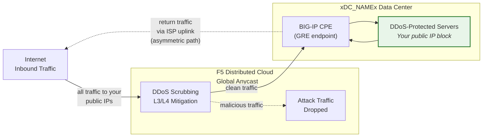
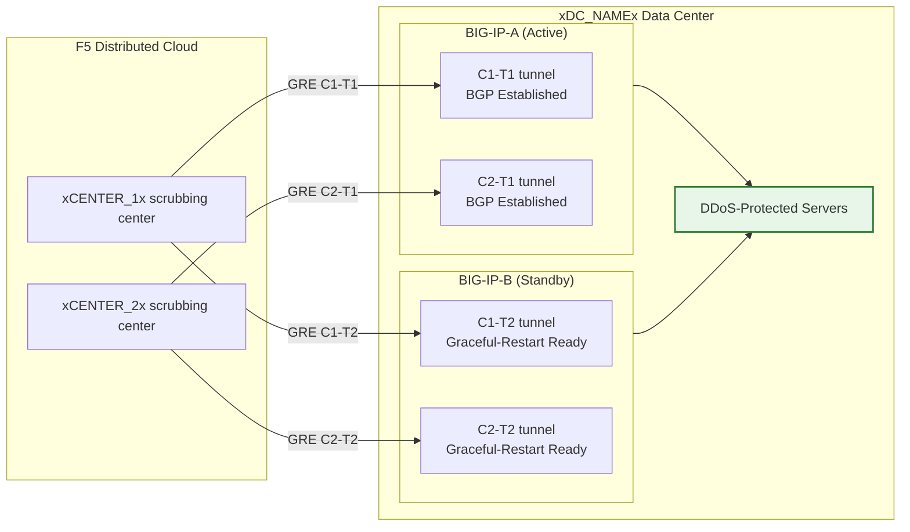

## Cloud GRE/BGP BIG-IP

- تكوين **أنفاق GRE** و**تناظر BGP** من زوج BIG-IP HA
  (يعمل كمعدات مقر العميل، CPE)، مع أنفاق مستقلة
  لكل وحدة.
- الاتصال بمراكز تنقية **Cloud DDoS Mitigation**
  في **وضع التوجيه** (L3/L4).

## المتطلبات

- خدمة **L3/L4 Routed DDoS Mitigation** السحابية
  (Always On أو Always Available) مُفعّلة لمستأجرك.
- BIG-IP مع:
    - LTM (أو وحدات الشبكات المكافئة).
    - **التوجيه الديناميكي (BGP)** مرخّص ومُفعّل.
- وضع التوجيه: على الأقل بادئة واحدة **مُعلنة علنياً /24 (أو أقصر)**
  للحماية (الحد الأدنى لـ IPv6 هو **/48**).
    - البادئات المحمية **يجب أن تكون قابلة للتوجيه علنياً** (غير RFC 1918).
     يجب أن تكون نقاط نهاية GRE الخارجية أيضاً قابلة للتوجيه علنياً عندما تمر الأنفاق
     عبر الإنترنت العام؛ يمكن للنشرات التي تستخدم اتصالاً خاصاً
     (L2، تناظر خاص) استخدام عناوين نقاط نهاية RFC 1918.
- الاتصال بين مركز البيانات/الموجه الخاص بك ومراكز
  التنقية السحابية.

## بنية التوفر العالي (HA)

يتم نشر BIG-IP كـ **زوج HA نشط/احتياطي**، حيث تحصل كل وحدة
على أنفاق GRE مستقلة خاصة بها وجلسات BGP إلى كل
مركز تنقية:

- **نقاط نهاية أنفاق مستقلة**: كل وحدة BIG-IP لها عنوان IP خارجي ذاتي
  غير عائم خاص بها (`traffic-group-local-only`) ومجموعتها
  الخاصة من أنفاق GRE. يستخدم BIG-IP-A العنوان `xBIGIP_A_OUTER_V4x` و
  BIG-IP-B يستخدم `xBIGIP_B_OUTER_V4x` كنقاط نهاية أنفاق. هذا يتجنب
  الاعتماد على عنوان IP عائم لمصدر الأنفاق.
- **جلسات BGP مستقلة**: كل وحدة تشغل جلسات BGP الخاصة بها
  عبر أنفاقها الخاصة. يتناظر BIG-IP-A مع C1-T1 وC2-T1؛
  ويتناظر BIG-IP-B مع C1-T2 وC2-T2. عند الانتقال التلقائي، تكون جلسات BGP
  الخاصة بالوحدة الاحتياطية مُنشأة بالفعل، لذا يمكن للسحابة
  تحويل حركة المرور فوراً.
- **مزامنة التكوين**: يتم مزامنة تكوينات الأنفاق وعناوين IP الذاتية والتوجيه
  بين الوحدات عبر **config-sync**. نظراً لأن تكوين BGP في `imish`
  خاص بكل وحدة، فإن كل وحدة تحتفظ ببيانات الجيران
  الخاصة بها. تحقق من أن المزامنة تشمل جميع كائنات tmsh.
- **سلوك BGP نشط/احتياطي**: تُعلن الوحدة النشطة عن
  البادئات المحمية بسمات BGP عادية. يمكن للوحدة الاحتياطية
  إما الإعلان عن نفس البادئات مع إضافة AS-path أطول
  (مما يجعلها أقل تفضيلاً) أو إيقاف الإعلانات
  حتى الانتقال التلقائي. نسّق النهج مع فريق SOC.
- **تقارب الانتقال التلقائي**: مع تفعيل `graceful-restart` والأنفاق
  المستقلة، تمتلك الوحدة النشطة الجديدة بالفعل جلسات BGP
  مُنشأة. يعتمد التقارب على تحول اختيار أفضل مسار BGP
  إلى إعلانات الوحدة النشطة حديثاً. اختبر باستخدام
  `run sys failover standby`.

:::note
نموذج التوفر العالي ذو الأنفاق المستقلة أعلاه هو النهج الموصى به
لتكرار الأجهزة من جانب العميل. تحقق من تصميم الانتقال التلقائي الخاص بك
مع فريق حسابك قبل الانتقال إلى
الإنتاج، خاصة فيما يتعلق باستراتيجية إضافة AS-path وتوقيت
إعادة تقارب BGP.
:::
