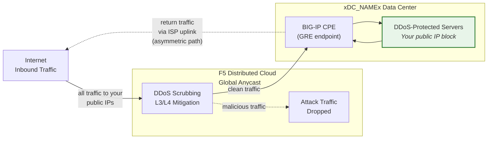
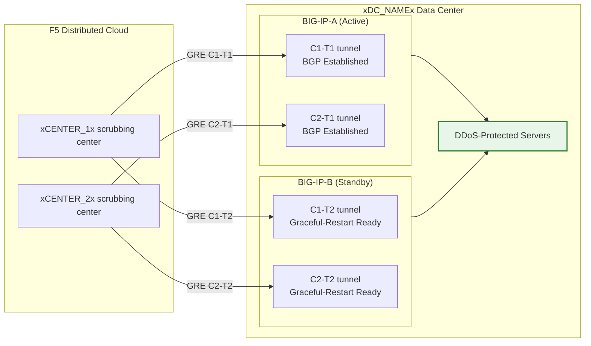

## Cloud GRE/BGP BIG-IP

- تكوين **أنفاق GRE** و**نظير BGP** من زوج BIG-IP عالي التوفر
  (يعمل بوصفه معدات مبنى العميل، CPE)، مع أنفاق مستقلة
  لكل وحدة.
- الاتصال بمراكز التنظيف الخاصة بـ **التخفيف السحابي من DDoS**
  في **الوضع الموجَّه** (L3/L4).

## المتطلبات

- خدمة **التخفيف الموجَّه من DDoS على طبقتي L3/L4 السحابية**
  (دائم التشغيل أو دائم التوفر) مُفعَّلة لمستأجرك.
- BIG-IP مزوَّد بـ:
    - LTM (أو وحدات شبكات مكافئة).
    - **التوجيه الديناميكي (BGP)** مرخَّص ومُفعَّل.
- الوضع الموجَّه: بادئة **/24 (أو أقصر) مُعلَنة علنيًا** على الأقل
  للحماية (الحد الأدنى لـ IPv6 هو **/48**).
    - يجب أن تكون البادئات المحمية **قابلة للتوجيه علنيًا** (غير RFC 1918).
     يجب أن تكون نقاط النهاية الخارجية لـ GRE قابلة للتوجيه علنيًا أيضًا عندما تعبر الأنفاق
     الإنترنت العام؛ وقد تستخدم عمليات النشر التي تعتمد على الاتصال الخاص
     (L2، النظير الخاص) عناوين نقاط نهاية RFC 1918.
- الاتصال بين مركز البيانات/الموجِّه لديك ومركز (مراكز)
  التنظيف السحابية.

## معمارية التوفر العالي

يُنشر BIG-IP بوصفه **زوجًا عالي التوفر من النوع نشط/احتياطي**، وتحصل كل وحدة
على أنفاق GRE مستقلة وجلسات BGP خاصة بها لكل
مركز تنظيف:

- **نقاط نهاية الأنفاق المستقلة**: تمتلك كل وحدة BIG-IP عنوان IP خارجيًا ذاتيًا
  غير عائم خاصًا بها (`traffic-group-local-only`) ومجموعتها الخاصة من أنفاق GRE.
  تستخدم BIG-IP-A عنوان `xBIGIP_A_OUTER_V4x` وتستخدم
  BIG-IP-B عنوان `xBIGIP_B_OUTER_V4x` كنقاط نهاية للأنفاق. يتجنب ذلك
  الاعتماد على عنوان IP عائم لمصدر النفق.
- **جلسات BGP المستقلة**: تُشغِّل كل وحدة جلسات BGP الخاصة بها
  عبر أنفاقها الخاصة. تتعامل BIG-IP-A مع C1-T1 و C2-T1 كنظراء؛
  وتتعامل BIG-IP-B مع C1-T2 و C2-T2 كنظراء. عند الإخفاق، تكون جلسات BGP
  الخاصة بالوحدة الاحتياطية قد أُنشئت مسبقًا، بحيث يمكن
  للسحابة تحويل حركة المرور فورًا.
- **مزامنة التهيئة**: يتم مزامنة تهيئات الأنفاق وعناوين IP الذاتية والتوجيه
  بين الوحدات عبر **config-sync**. نظرًا لأن تهيئة BGP الخاصة بـ `imish`
  تكون لكل وحدة على حدة، تحتفظ كل وحدة ببيانات الجوار الخاصة بها.
  تحقق من أن المزامنة تشمل جميع كائنات tmsh.
- **سلوك BGP في النمط النشط/الاحتياطي**: تُعلن الوحدة النشطة عن
  البادئات المحمية بسمات BGP الاعتيادية. يمكن للوحدة الاحتياطية إما الإعلان عن
  البادئات ذاتها بإعادة إلحاق AS-path أطول (مما يجعلها أقل تفضيلًا) أو
  إيقاف الإعلانات حتى يحدث الإخفاق. تنسَّق مع مركز العمليات الأمنية (SOC)
  بشأن النهج المناسب.
- **تقارب الإخفاق**: مع تفعيل `graceful-restart` والأنفاق المستقلة،
  تمتلك الوحدة النشطة الجديدة جلسات BGP مُنشأة مسبقًا. يعتمد التقارب على
  انتقال اختيار المسار الأفضل في BGP إلى إعلانات الوحدة النشطة حديثًا.
  اختبر ذلك باستخدام `run sys failover standby`.

:::note
نموذج التوفر العالي بالأنفاق المستقلة المذكور أعلاه هو النهج الموصى به
لتحقيق التكرار على جانب جهاز العميل. تحقق من تصميم الإخفاق المحدد
الخاص بك مع فريق حسابك قبل الانتقال إلى
بيئة الإنتاج، لا سيما فيما يتعلق باستراتيجية إعادة إلحاق AS-path
وتوقيت إعادة تقارب BGP.
:::
