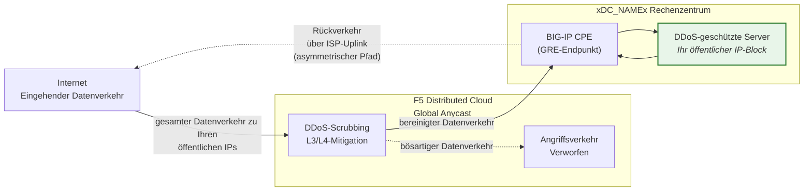
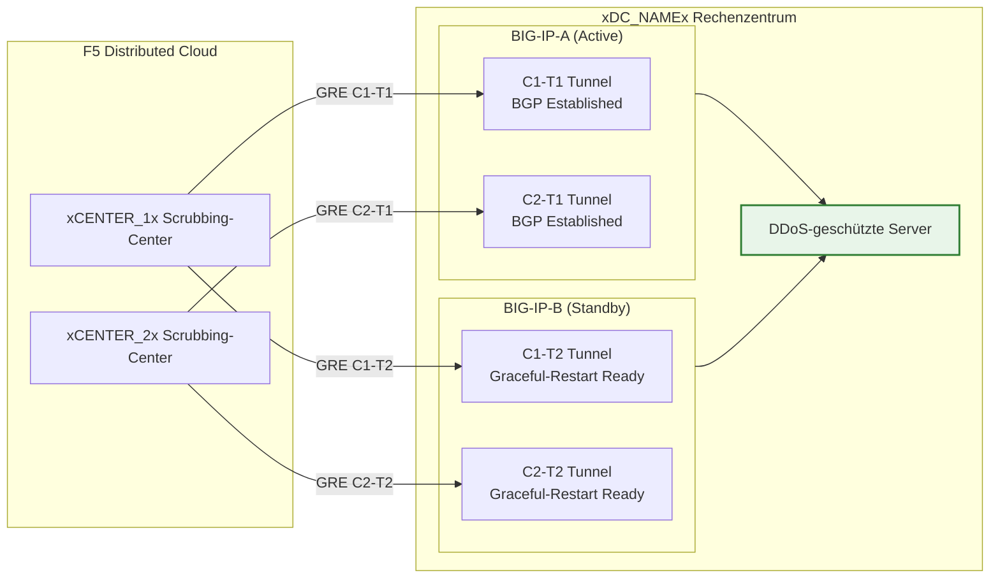

## Cloud GRE/BGP BIG-IP

- Konfigurieren Sie **GRE-Tunnel** und **BGP-Peering** von einem BIG-IP-HA-Paar
  (als Customer Premises Equipment, CPE fungierend), mit unabhängigen
  Tunneln pro Einheit.
- Verbindung zu den **Cloud DDoS Mitigation**-Scrubbing-Centern
  im **Routed Mode** (L3/L4).

## Anforderungen

- Cloud **L3/L4 Routed DDoS Mitigation**-Dienst
  (Always On oder Always Available), für Ihren Tenant aktiviert.
- BIG-IP mit:
    - LTM (oder gleichwertige Netzwerkmodule).
    - **Dynamisches Routing (BGP)** lizenziert und aktiviert.
- Routed Mode: mindestens ein **öffentlich angekündigtes /24 (oder kürzeres)**
  Präfix zum Schutz (IPv6 Minimum ist **/48**).
    - Geschützte Präfixe **müssen öffentlich routbar sein** (nicht RFC 1918).
     Äußere GRE-Endpunkte müssen ebenfalls öffentlich routbar sein, wenn die Tunnel
     über das öffentliche Internet verlaufen; Bereitstellungen mit privater
     Konnektivität (L2, privates Peering) können RFC 1918-Endpunktadressen
     verwenden.
- Konnektivität zwischen Ihrem Rechenzentrum/Router und dem/den
  Cloud-Scrubbing-Center(n).

## HA-Architektur

Das BIG-IP wird als **Active/Standby-HA-Paar** bereitgestellt. Jede Einheit
erhält eigene unabhängige GRE-Tunnel und BGP-Sessions zu jedem
Scrubbing-Center:

- **Unabhängige Tunnel-Endpunkte**: Jede BIG-IP-Einheit hat ihre eigene
  nicht-floating äußere Self-IP (`traffic-group-local-only`) und ihren
  eigenen Satz von GRE-Tunneln. BIG-IP-A verwendet `xBIGIP_A_OUTER_V4x` und
  BIG-IP-B verwendet `xBIGIP_B_OUTER_V4x` als Tunnel-Endpunkte. Dies vermeidet
  die Abhängigkeit von einer Floating-IP für das Tunnel-Sourcing.
- **Unabhängige BGP-Sessions**: Jede Einheit betreibt ihre eigenen BGP-Sessions
  über ihre eigenen Tunnel. BIG-IP-A peert mit C1-T1 und C2-T1;
  BIG-IP-B peert mit C1-T2 und C2-T2. Bei einem Failover sind die
  BGP-Sessions der Standby-Einheit bereits aufgebaut, sodass die
  Cloud den Datenverkehr sofort umleiten kann.
- **Config Sync**: Tunnel-, Self-IP- und Routing-Konfigurationen werden
  zwischen den Einheiten über **config-sync** synchronisiert. Da die `imish`-
  BGP-Konfiguration pro Einheit ist, pflegt jede Einheit ihre eigenen
  Neighbor-Statements. Überprüfen Sie, dass die Synchronisierung alle tmsh-Objekte umfasst.
- **Active/Standby-BGP-Verhalten**: Die aktive Einheit kündigt
  geschützte Präfixe mit normalen BGP-Attributen an. Die Standby-Einheit
  kann entweder dieselben Präfixe mit einem längeren AS-Path-Prepend
  ankündigen (wodurch sie weniger bevorzugt wird) oder Ankündigungen
  bis zum Failover unterdrücken. Stimmen Sie den Ansatz mit dem SOC ab.
- **Failover-Konvergenz**: Mit aktiviertem `graceful-restart` und
  unabhängigen Tunneln hat die neue aktive Einheit bereits aufgebaute
  BGP-Sessions. Die Konvergenz hängt davon ab, wie die BGP-Best-Path-Auswahl
  auf die Ankündigungen der neu aktiven Einheit umschaltet. Testen Sie mit
  `run sys failover standby`.

:::note
Das oben beschriebene HA-Modell mit unabhängigen Tunneln ist der empfohlene Ansatz
für kundenseitige Geräte-Redundanz. Validieren Sie Ihr spezifisches
Failover-Design mit Ihrem Account-Team, bevor Sie in die
Produktion gehen, insbesondere hinsichtlich der AS-Path-Prepend-Strategie und des
BGP-Rekonvergenz-Timings.
:::
