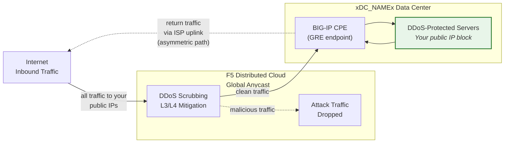

## Cloud GRE/BGP BIG-IP

- Konfigurieren Sie **GRE-Tunnel** und **BGP-Peering** von einem BIG-IP-HA-Paar
  (das als Customer Premises Equipment, CPE, fungiert), mit unabhängigen
  Tunneln pro Einheit.
- Verbindung zu den **Cloud-DDoS-Mitigation**-Scrubbing-Zentren
  im **Routed-Modus** (L3/L4).

## Anforderungen

- Cloud **L3/L4 Routed DDoS Mitigation**-Dienst
  (Always On oder Always Available) für Ihren Tenant aktiviert.
- BIG-IP mit:
    - LTM (oder entsprechenden Netzwerkmodulen).
    - **Dynamisches Routing (BGP)** lizenziert und aktiviert.
- Routed-Modus: mindestens ein **öffentlich beworbenes /24 (oder kürzer)**
  Präfix für den Schutz (IPv6-Minimum ist **/48**).
    - Geschützte Präfixe **müssen öffentlich routbar sein** (keine RFC-1918-Adressen).
     Äußere GRE-Endpunkte müssen ebenfalls öffentlich routbar sein, wenn Tunnel
     das öffentliche Internet durchqueren; Bereitstellungen mit privater
     Konnektivität (L2, privates Peering) können RFC-1918-Endpunktadressen verwenden.
- Konnektivität zwischen Ihrem Rechenzentrum/Router und den
  Cloud-Scrubbing-Zentren.

## HA-Architektur

Das BIG-IP wird als **aktives/Standby-HA-Paar** bereitgestellt, wobei jede Einheit
eigene unabhängige GRE-Tunnel und BGP-Sitzungen zu jedem Scrubbing-Zentrum erhält:

- **Unabhängige Tunnel-Endpunkte**: Jede BIG-IP-Einheit verfügt über eine eigene
  nicht-floating äußere Self-IP (`traffic-group-local-only`) und einen eigenen Satz
  von GRE-Tunneln. BIG-IP-A verwendet `xBIGIP_A_OUTER_V4x` und
  BIG-IP-B verwendet `xBIGIP_B_OUTER_V4x` als Tunnel-Endpunkte. Dadurch wird
  die Abhängigkeit von einer Floating-IP für das Tunnel-Sourcing vermieden.
- **Unabhängige BGP-Sitzungen**: Jede Einheit betreibt eigene BGP-Sitzungen
  über ihre eigenen Tunnel. BIG-IP-A peert mit C1-T1 und C2-T1;
  BIG-IP-B peert mit C1-T2 und C2-T2. Bei einem Failover sind die BGP-Sitzungen
  der Standby-Einheit bereits etabliert, sodass die Cloud den Datenverkehr
  sofort umleiten kann.
- **Konfigurationssynchronisierung**: Tunnel-, Self-IP- und Routing-Konfigurationen werden
  zwischen den Einheiten über **config-sync** synchronisiert. Da die `imish`-BGP-Konfiguration
  pro Einheit gilt, pflegt jede Einheit eigene Neighbor-Statements. Stellen Sie sicher,
  dass die Synchronisierung alle tmsh-Objekte umfasst.
- **Aktives/Standby-BGP-Verhalten**: Die aktive Einheit bewirbt geschützte Präfixe
  mit normalen BGP-Attributen. Die Standby-Einheit kann dieselben Präfixe entweder
  mit einem längeren AS-Path-Prepend bewerben (wodurch sie weniger bevorzugt wird)
  oder Ankündigungen bis zum Failover unterdrücken. Stimmen Sie das Vorgehen
  mit dem SOC ab.
- **Failover-Konvergenz**: Mit aktiviertem `graceful-restart` und unabhängigen Tunneln
  verfügt die neue aktive Einheit bereits über etablierte BGP-Sitzungen. Die Konvergenz
  hängt davon ab, wie schnell die BGP-Best-Path-Auswahl auf die Ankündigungen der
  neu aktiven Einheit umschaltet. Testen Sie mit `run sys failover standby`.

:::note
Das oben beschriebene HA-Modell mit unabhängigen Tunneln ist der empfohlene Ansatz
für die Geräteredundanz auf Kundenseite. Validieren Sie Ihr spezifisches
Failover-Design mit Ihrem Account-Team, bevor Sie in den Produktionsbetrieb gehen,
insbesondere hinsichtlich der AS-Path-Prepend-Strategie und des BGP-Rekonvergenz-Timings.
:::
