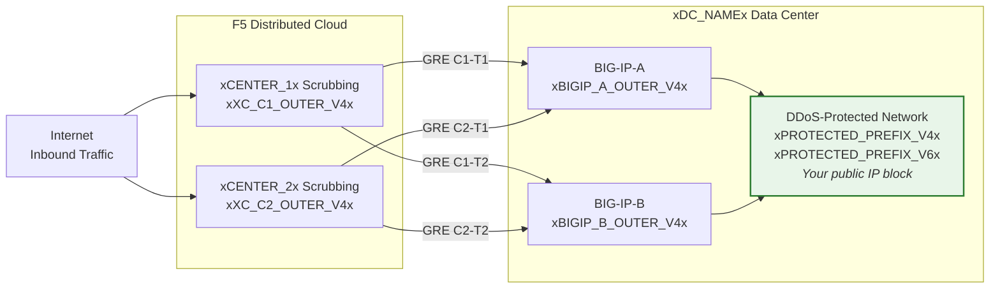
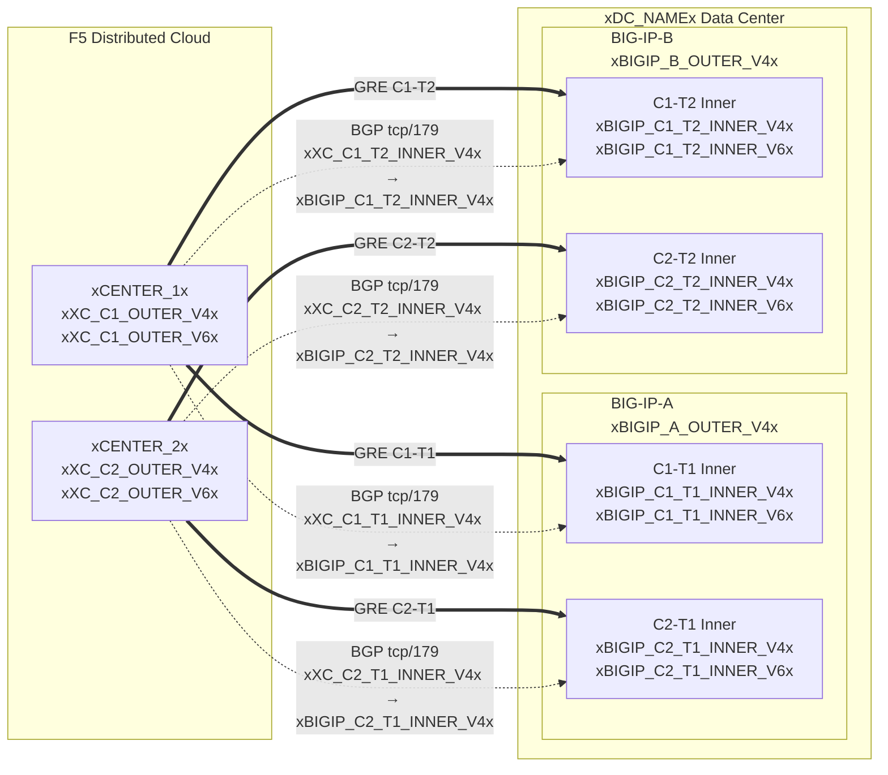

## Topologie und Adressen

Konfiguration für das **xDC_NAMEx**-Rechenzentrum
mit Verbindung zu Cloud-Scrubbing-Zentren.

:::note
**Dies sind Beispielwerte.** Ersetzen Sie diese durch kundenspezifische und
vom SOC bereitgestellte Werte unter Verwendung der obigen Tabellen.

Geschützte Präfixe **müssen öffentlich routbar sein** (nicht RFC 1918).
Die äußeren GRE-Endpunkt-IPs müssen ebenfalls öffentlich routbar sein, wenn die Tunnel
über das öffentliche Internet verlaufen; private Konnektivität (L2, privates
Peering) kann RFC-1918-Endpunkte ermöglichen. Siehe
[K000147949](https://my.f5.com/manage/s/article/K000147949) für Beispiele mit korrekten Dokumentationsadressen.

Erstellen Sie für Redundanz **2 Tunnel pro BIG-IP-Einheit** zu verschiedenen
geografisch verteilten Scrubbing-Zentren (insgesamt 4 Tunnel für ein HA-Paar).
:::

## Arbeitsblätter

Verwenden Sie die folgenden XC- und BIG-IP-Arbeitsblätter als Referenz beim Erstellen der Tunnel-Konfiguration.

### XC

**Tunnel C1-T1 — Center 1 zu BIG-IP-A:**

- Äußere GRE-IPs (für Tunnel-Endpunkte):
    - IPv4 SRC: `xXC_C1_OUTER_V4x/24`
    - IPv4 DST: `xBIGIP_A_OUTER_V4x/24`
    - IPv6 SRC: `xXC_C1_OUTER_V6x/64`
    - IPv6 DST: `xBIGIP_A_OUTER_V6x/64`

- Innere GRE-IPs (für BGP-Sitzung):
    - IPv4: `xXC_C1_T1_INNER_V4x/30`
    - IPv6: `xXC_C1_T1_INNER_V6x/64`

**Tunnel C1-T2 — Center 1 zu BIG-IP-B:**

- Äußere GRE-IPs (für Tunnel-Endpunkte):
    - IPv4 SRC: `xXC_C1_OUTER_V4x/24`
    - IPv4 DST: `xBIGIP_B_OUTER_V4x/24`
    - IPv6 SRC: `xXC_C1_OUTER_V6x/64`
    - IPv6 DST: `xBIGIP_B_OUTER_V6x/64`

- Innere GRE-IPs (für BGP-Sitzung):
    - IPv4: `xXC_C1_T2_INNER_V4x/30`
    - IPv6: `xXC_C1_T2_INNER_V6x/64`

**Tunnel C2-T1 — Center 2 zu BIG-IP-A:**

- Äußere GRE-IPs (für Tunnel-Endpunkte):
    - IPv4 SRC: `xXC_C2_OUTER_V4x/24`
    - IPv4 DST: `xBIGIP_A_OUTER_V4x/24`
    - IPv6 SRC: `xXC_C2_OUTER_V6x/64`
    - IPv6 DST: `xBIGIP_A_OUTER_V6x/64`

- Innere GRE-IPs (für BGP-Sitzung):
    - IPv4: `xXC_C2_T1_INNER_V4x/30`
    - IPv6: `xXC_C2_T1_INNER_V6x/64`

**Tunnel C2-T2 — Center 2 zu BIG-IP-B:**

- Äußere GRE-IPs (für Tunnel-Endpunkte):
    - IPv4 SRC: `xXC_C2_OUTER_V4x/24`
    - IPv4 DST: `xBIGIP_B_OUTER_V4x/24`
    - IPv6 SRC: `xXC_C2_OUTER_V6x/64`
    - IPv6 DST: `xBIGIP_B_OUTER_V6x/64`

- Innere GRE-IPs (für BGP-Sitzung):
    - IPv4: `xXC_C2_T2_INNER_V4x/30`
    - IPv6: `xXC_C2_T2_INNER_V6x/64`

:::note[Innere (Transit-)IPs]
Innere IPs wie `10.10.10.0/30` verwenden RFC-1918-Adressen. Dies ist
korrekt, da sie innerhalb des GRE-Tunnels gekapselt sind und nie
im öffentlichen Internet erscheinen. Geschützte Präfixe müssen immer
öffentlich routbar sein; äußere Endpunkt-IPs müssen öffentlich routbar sein, wenn
die Tunnel über das öffentliche Internet verlaufen.
:::

:::note[Innere IPv6-Verbindungen]
Innere IPv6-Verbindungen verwenden hier /64-Präfixe, um gängigen
Cloud-Standardwerten zu entsprechen. Für Punkt-zu-Punkt-Verbindungen ist /127 gemäß
[RFC 6164](https://datatracker.ietf.org/doc/html/rfc6164) bevorzugt, um Neighbor-Discovery-Erschöpfung zu vermeiden. Verwenden Sie /127,
wenn die SOC-Tunnel-Zuweisung dies unterstützt.
:::

### BIG-IP

**BIG-IP-A** (äußere IP `xBIGIP_A_OUTER_V4x` / `xBIGIP_A_OUTER_V6x`):

- Äußere GRE-IPs:
    - IPv4 SRC: `xBIGIP_A_OUTER_V4x/24`
    - IPv4 DST (Center 1): `xXC_C1_OUTER_V4x/24`
    - IPv4 DST (Center 2): `xXC_C2_OUTER_V4x/24`
    - IPv6 SRC: `xBIGIP_A_OUTER_V6x/64`
    - IPv6 DST (Center 1): `xXC_C1_OUTER_V6x/64`
    - IPv6 DST (Center 2): `xXC_C2_OUTER_V6x/64`

- Innere GRE-IPs — Tunnel C1-T1:
    - IPv4: `xBIGIP_C1_T1_INNER_V4x/30`
    - IPv6: `xBIGIP_C1_T1_INNER_V6x/64`

- Innere GRE-IPs — Tunnel C2-T1:
    - IPv4: `xBIGIP_C2_T1_INNER_V4x/30`
    - IPv6: `xBIGIP_C2_T1_INNER_V6x/64`

**BIG-IP-B** (äußere IP `xBIGIP_B_OUTER_V4x` / `xBIGIP_B_OUTER_V6x`):

- Äußere GRE-IPs:
    - IPv4 SRC: `xBIGIP_B_OUTER_V4x/24`
    - IPv4 DST (Center 1): `xXC_C1_OUTER_V4x/24`
    - IPv4 DST (Center 2): `xXC_C2_OUTER_V4x/24`
    - IPv6 SRC: `xBIGIP_B_OUTER_V6x/64`
    - IPv6 DST (Center 1): `xXC_C1_OUTER_V6x/64`
    - IPv6 DST (Center 2): `xXC_C2_OUTER_V6x/64`

- Innere GRE-IPs — Tunnel C1-T2:
    - IPv4: `xBIGIP_C1_T2_INNER_V4x/30`
    - IPv6: `xBIGIP_C1_T2_INNER_V6x/64`

- Innere GRE-IPs — Tunnel C2-T2:
    - IPv4: `xBIGIP_C2_T2_INNER_V4x/30`
    - IPv6: `xBIGIP_C2_T2_INNER_V6x/64`

- Geschützte Präfixe (an Cloud annonciert):
    - IPv4: `xPROTECTED_NET_V4xxPROTECTED_CIDR_V4x`
    - IPv6: `xPROTECTED_PREFIX_V6x`

### Detailliertes Topologie-Diagramm

