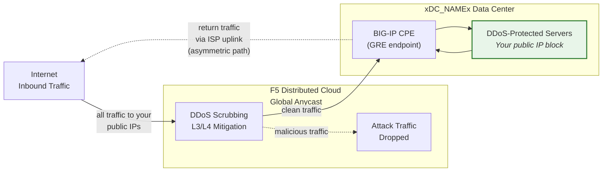
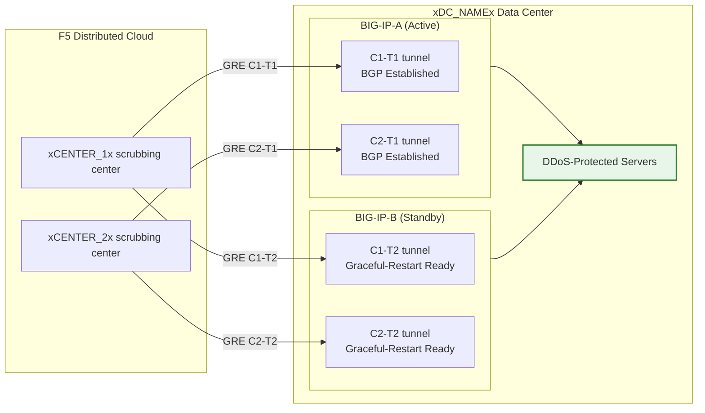

## GRE/BGP en la nube con BIG-IP

- Configure **túneles GRE** y **emparejamiento BGP** desde un par HA de BIG-IP
  (actuando como equipo en las instalaciones del cliente, CPE), con túneles
  independientes por unidad.
- Conéctese a los centros de depuración de **Mitigación DDoS en la nube**
  en **modo enrutado** (L3/L4).

## Requisitos

- Servicio de **Mitigación DDoS enrutada L3/L4** en la nube
  (Always On o Always Available) habilitado para su tenant.
- BIG-IP con:
    - LTM (o módulos de red equivalentes).
    - **Enrutamiento dinámico (BGP)** con licencia y habilitado.
- Modo enrutado: al menos un prefijo **/24 (o más corto) anunciado públicamente**
  para protección (el mínimo para IPv6 es **/48**).
    - Los prefijos protegidos **deben ser enrutables públicamente** (no RFC 1918).
     Los extremos externos de GRE también deben ser enrutables públicamente cuando los túneles
     atraviesan Internet público; las implementaciones que utilizan conectividad privada
     (L2, peering privado) pueden usar direcciones de extremo RFC 1918.
- Conectividad entre su centro de datos/router y el centro(s) de
  depuración en la nube.

## Arquitectura HA

El BIG-IP se implementa como un **par HA activo/en espera**, donde cada unidad
obtiene sus propios túneles GRE independientes y sesiones BGP hacia cada
centro de depuración:

- **Extremos de túnel independientes**: Cada unidad BIG-IP tiene su propia
  IP externa no flotante (`traffic-group-local-only`) y su propio conjunto
  de túneles GRE. BIG-IP-A utiliza `xBIGIP_A_OUTER_V4x` y
  BIG-IP-B utiliza `xBIGIP_B_OUTER_V4x` como extremos de túnel. Esto evita
  la dependencia de una IP flotante para el origen del túnel.
- **Sesiones BGP independientes**: Cada unidad ejecuta sus propias sesiones BGP
  a través de sus propios túneles. BIG-IP-A establece peering con C1-T1 y C2-T1;
  BIG-IP-B establece peering con C1-T2 y C2-T2. Durante una conmutación por error, las
  sesiones BGP de la unidad en espera ya están establecidas, por lo que la
  nube puede redirigir el tráfico de inmediato.
- **Sincronización de configuración**: Las configuraciones de túnel, IP propia y
  enrutamiento se sincronizan entre unidades mediante **config-sync**. Debido a que la
  configuración BGP de `imish` es por unidad, cada unidad mantiene sus propias
  declaraciones de vecino. Verifique que la sincronización incluya todos los objetos tmsh.
- **Comportamiento BGP activo/en espera**: La unidad activa anuncia los prefijos
  protegidos con atributos BGP normales. La unidad en espera puede anunciar los
  mismos prefijos con un prepend de AS-path más largo (haciéndolos menos preferidos)
  o suprimir los anuncios hasta la conmutación por error. Coordine el enfoque con el SOC.
- **Convergencia en conmutación por error**: Con `graceful-restart` habilitado y
  túneles independientes, la nueva unidad activa ya tiene sesiones BGP establecidas.
  La convergencia depende de que la selección del mejor camino BGP se desplace hacia
  los anuncios de la unidad recién activa. Realice pruebas con
  `run sys failover standby`.

:::note
El modelo HA de túneles independientes descrito anteriormente es el enfoque recomendado
para la redundancia de dispositivos en el lado del cliente. Valide su diseño específico
de conmutación por error con su equipo de cuenta antes de pasar a producción,
especialmente en lo que respecta a la estrategia de prepend de AS-path y los tiempos
de reconvergencia BGP.
:::
