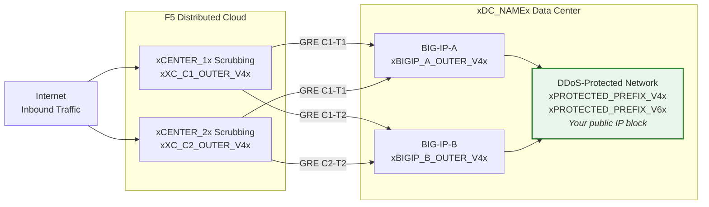
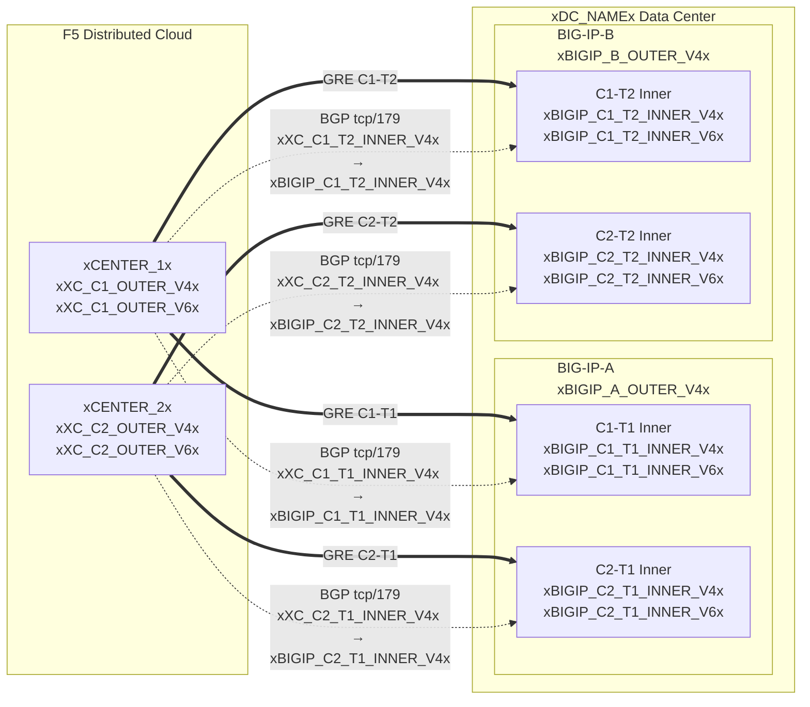

## Topología y direcciones

Configuración para el centro de datos **xDC_NAMEx**
que se conecta a los centros de depuración en la nube.

:::note
**Estos son valores de ejemplo.** Reemplácelos con valores específicos del cliente y
valores proporcionados por el SOC utilizando las tablas anteriores.

Los prefijos protegidos **deben ser enrutables públicamente** (no RFC 1918).
Las IPs externas del túnel GRE también deben ser enrutables públicamente cuando los túneles
atraviesan la Internet pública; la conectividad privada (L2, peering privado)
puede permitir endpoints RFC 1918. Consulte
[K000147949](https://my.f5.com/manage/s/article/K000147949) para ver ejemplos usando direcciones de documentación adecuadas.

Para redundancia, cree **2 túneles por unidad BIG-IP** hacia diferentes
centros de depuración geolocalizados (4 túneles en total para un par HA).
:::

## Hojas de trabajo

Utilice las siguientes hojas de trabajo de XC y BIG-IP como referencia al construir la configuración del túnel.

### XC

**Túnel C1-T1 — Centro 1 a BIG-IP-A:**

- IPs externas GRE (para endpoints del túnel):
    - IPv4 SRC: `xXC_C1_OUTER_V4x/24`
    - IPv4 DST: `xBIGIP_A_OUTER_V4x/24`
    - IPv6 SRC: `xXC_C1_OUTER_V6x/64`
    - IPv6 DST: `xBIGIP_A_OUTER_V6x/64`

- IPs internas GRE (para sesión BGP):
    - IPv4: `xXC_C1_T1_INNER_V4x/30`
    - IPv6: `xXC_C1_T1_INNER_V6x/64`

**Túnel C1-T2 — Centro 1 a BIG-IP-B:**

- IPs externas GRE (para endpoints del túnel):
    - IPv4 SRC: `xXC_C1_OUTER_V4x/24`
    - IPv4 DST: `xBIGIP_B_OUTER_V4x/24`
    - IPv6 SRC: `xXC_C1_OUTER_V6x/64`
    - IPv6 DST: `xBIGIP_B_OUTER_V6x/64`

- IPs internas GRE (para sesión BGP):
    - IPv4: `xXC_C1_T2_INNER_V4x/30`
    - IPv6: `xXC_C1_T2_INNER_V6x/64`

**Túnel C2-T1 — Centro 2 a BIG-IP-A:**

- IPs externas GRE (para endpoints del túnel):
    - IPv4 SRC: `xXC_C2_OUTER_V4x/24`
    - IPv4 DST: `xBIGIP_A_OUTER_V4x/24`
    - IPv6 SRC: `xXC_C2_OUTER_V6x/64`
    - IPv6 DST: `xBIGIP_A_OUTER_V6x/64`

- IPs internas GRE (para sesión BGP):
    - IPv4: `xXC_C2_T1_INNER_V4x/30`
    - IPv6: `xXC_C2_T1_INNER_V6x/64`

**Túnel C2-T2 — Centro 2 a BIG-IP-B:**

- IPs externas GRE (para endpoints del túnel):
    - IPv4 SRC: `xXC_C2_OUTER_V4x/24`
    - IPv4 DST: `xBIGIP_B_OUTER_V4x/24`
    - IPv6 SRC: `xXC_C2_OUTER_V6x/64`
    - IPv6 DST: `xBIGIP_B_OUTER_V6x/64`

- IPs internas GRE (para sesión BGP):
    - IPv4: `xXC_C2_T2_INNER_V4x/30`
    - IPv6: `xXC_C2_T2_INNER_V6x/64`

:::note[IPs internas (de tránsito)]
Las IPs internas como `10.10.10.0/30` utilizan direcciones RFC 1918. Esto es
correcto porque están encapsuladas dentro del túnel GRE y nunca
aparecen en la Internet pública. Los prefijos protegidos siempre deben ser
enrutables públicamente; las IPs externas de los endpoints deben ser enrutables públicamente cuando
los túneles atraviesan la Internet pública.
:::

:::note[Enlaces internos IPv6]
Los enlaces internos IPv6 utilizan prefijos /64 aquí para coincidir con los valores
predeterminados comunes de la nube. Para enlaces punto a punto, se prefiere /127 según
[RFC 6164](https://datatracker.ietf.org/doc/html/rfc6164) para evitar el agotamiento del descubrimiento de vecinos. Utilice /127
si la asignación del túnel SOC lo admite.
:::

### BIG-IP

**BIG-IP-A** (IP externa `xBIGIP_A_OUTER_V4x` / `xBIGIP_A_OUTER_V6x`):

- IPs externas GRE:
    - IPv4 SRC: `xBIGIP_A_OUTER_V4x/24`
    - IPv4 DST (Centro 1): `xXC_C1_OUTER_V4x/24`
    - IPv4 DST (Centro 2): `xXC_C2_OUTER_V4x/24`
    - IPv6 SRC: `xBIGIP_A_OUTER_V6x/64`
    - IPv6 DST (Centro 1): `xXC_C1_OUTER_V6x/64`
    - IPv6 DST (Centro 2): `xXC_C2_OUTER_V6x/64`

- IPs internas GRE — Túnel C1-T1:
    - IPv4: `xBIGIP_C1_T1_INNER_V4x/30`
    - IPv6: `xBIGIP_C1_T1_INNER_V6x/64`

- IPs internas GRE — Túnel C2-T1:
    - IPv4: `xBIGIP_C2_T1_INNER_V4x/30`
    - IPv6: `xBIGIP_C2_T1_INNER_V6x/64`

**BIG-IP-B** (IP externa `xBIGIP_B_OUTER_V4x` / `xBIGIP_B_OUTER_V6x`):

- IPs externas GRE:
    - IPv4 SRC: `xBIGIP_B_OUTER_V4x/24`
    - IPv4 DST (Centro 1): `xXC_C1_OUTER_V4x/24`
    - IPv4 DST (Centro 2): `xXC_C2_OUTER_V4x/24`
    - IPv6 SRC: `xBIGIP_B_OUTER_V6x/64`
    - IPv6 DST (Centro 1): `xXC_C1_OUTER_V6x/64`
    - IPv6 DST (Centro 2): `xXC_C2_OUTER_V6x/64`

- IPs internas GRE — Túnel C1-T2:
    - IPv4: `xBIGIP_C1_T2_INNER_V4x/30`
    - IPv6: `xBIGIP_C1_T2_INNER_V6x/64`

- IPs internas GRE — Túnel C2-T2:
    - IPv4: `xBIGIP_C2_T2_INNER_V4x/30`
    - IPv6: `xBIGIP_C2_T2_INNER_V6x/64`

- Prefijos protegidos (anunciados a la nube):
    - IPv4: `xPROTECTED_NET_V4xxPROTECTED_CIDR_V4x`
    - IPv6: `xPROTECTED_PREFIX_V6x`

### Diagrama de topología detallado

