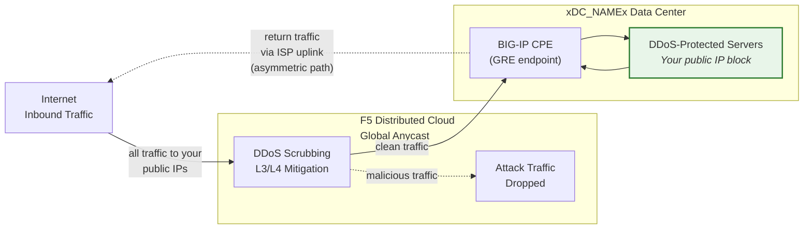
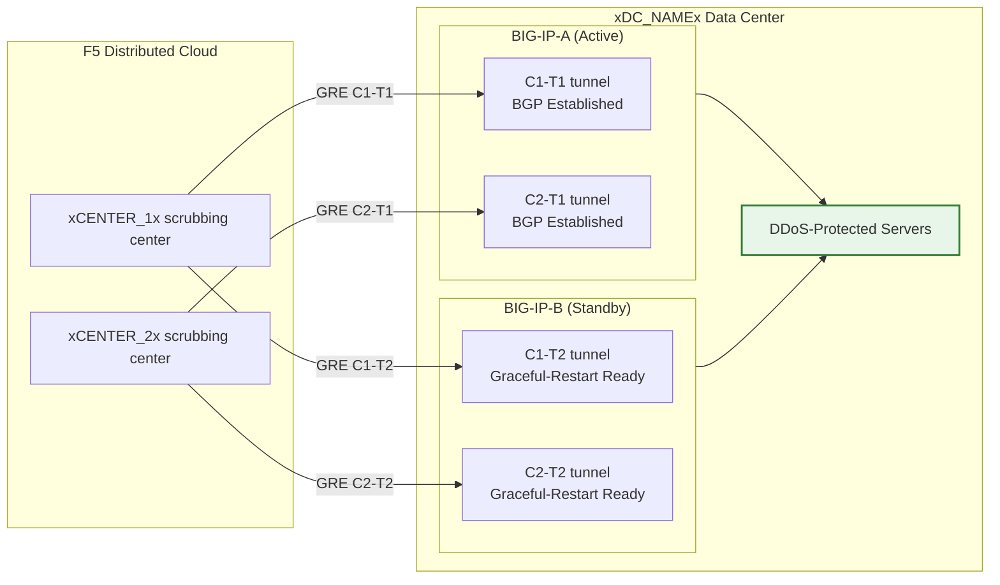

## Cloud GRE/BGP BIG-IP

- Configurer des **tunnels GRE** et un **peering BGP** depuis une paire HA BIG-IP
  (agissant comme équipement de locaux client, CPE), avec des tunnels
  indépendants par unité.
- Se connecter aux centres de nettoyage **Cloud DDoS Mitigation** en
  **mode routé** (L3/L4).

## Prérequis

- Service **L3/L4 Routed DDoS Mitigation** Cloud
  (Always On ou Always Available) activé pour votre tenant.
- BIG-IP avec :
    - LTM (ou modules réseau équivalents).
    - **Routage dynamique (BGP)** licencié et activé.
- Mode routé : au moins un préfixe **/24 (ou plus court) annoncé publiquement**
  pour la protection (le minimum IPv6 est **/48**).
    - Les préfixes protégés **doivent être routablement publics** (non-RFC 1918).
     Les points de terminaison externes GRE doivent également être routablement publics lorsque les tunnels
     traversent l'Internet public ; les déploiements utilisant une connectivité privée
     (L2, peering privé) peuvent utiliser des adresses de points de terminaison RFC 1918.
- Connectivité entre votre centre de données/routeur et le(s)
  centre(s) de nettoyage Cloud.

## Architecture HA

Le BIG-IP est déployé en tant que **paire HA actif/veille**, chaque unité
dispose de ses propres tunnels GRE indépendants et sessions BGP vers chaque
centre de nettoyage :

- **Points de terminaison de tunnel indépendants** : Chaque unité BIG-IP possède sa propre
  IP externe non flottante (`traffic-group-local-only`) et son
  propre ensemble de tunnels GRE. BIG-IP-A utilise `xBIGIP_A_OUTER_V4x` et
  BIG-IP-B utilise `xBIGIP_B_OUTER_V4x` comme points de terminaison de tunnel. Cela évite
  toute dépendance vis-à-vis d'une IP flottante pour la source du tunnel.
- **Sessions BGP indépendantes** : Chaque unité exécute ses propres sessions BGP
  sur ses propres tunnels. BIG-IP-A établit un peering avec C1-T1 et C2-T1 ;
  BIG-IP-B établit un peering avec C1-T2 et C2-T2. En cas de basculement, les
  sessions BGP de l'unité en veille sont déjà établies, de sorte que le
  Cloud peut rediriger le trafic immédiatement.
- **Synchronisation de configuration** : Les configurations de tunnels, d'IP externes et de routage sont
  synchronisées entre les unités via **config-sync**. Étant donné que la configuration BGP `imish`
  est par unité, chaque unité maintient ses propres instructions de voisin. Vérifiez que la synchronisation inclut tous les objets tmsh.
- **Comportement BGP actif/veille** : L'unité active annonce les
  préfixes protégés avec des attributs BGP normaux. L'unité en veille peut
  soit annoncer les mêmes préfixes avec un prepend de chemin AS plus long
  (le rendant moins préféré), soit supprimer les annonces
  jusqu'au basculement. Coordonnez l'approche avec le SOC.
- **Convergence lors du basculement** : Avec `graceful-restart` activé et des
  tunnels indépendants, la nouvelle unité active dispose déjà de sessions BGP
  établies. La convergence dépend de la sélection du meilleur chemin BGP
  se déplaçant vers les annonces de la nouvelle unité active. Testez avec
  `run sys failover standby`.

:::note
Le modèle HA à tunnels indépendants décrit ci-dessus est l'approche recommandée
pour la redondance des équipements côté client. Validez votre conception de basculement spécifique
avec votre équipe de compte avant la mise en production,
notamment en ce qui concerne la stratégie de prepend de chemin AS et le délai de
reconvergence BGP.
:::
