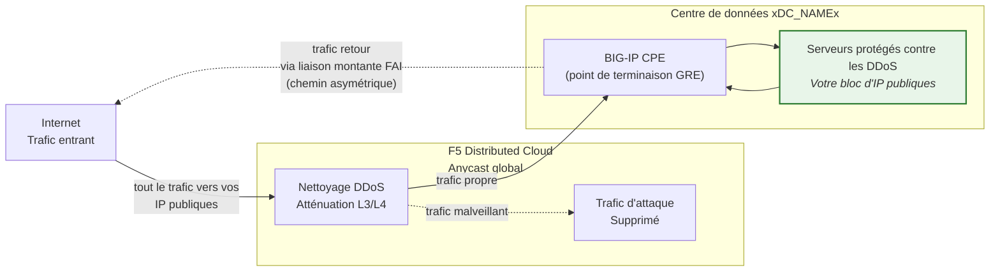
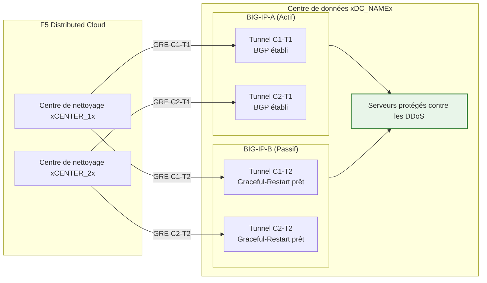

## Cloud GRE/BGP BIG-IP

- Configurez les **tunnels GRE** et le **peering BGP** depuis une paire HA BIG-IP
  (agissant en tant qu'équipement sur site client, CPE), avec des
  tunnels indépendants par unité.
- Connectez-vous à l'**atténuation DDoS Cloud** via les centres de
  nettoyage en **mode routé** (L3/L4).

## Prérequis

- Service Cloud d'**atténuation DDoS routée L3/L4**
  (Always On ou Always Available) activé pour votre tenant.
- BIG-IP avec :
    - LTM (ou modules réseau équivalents).
    - **Routage dynamique (BGP)** licencié et activé.
- Mode routé : au moins un préfixe **publiquement annoncé /24 (ou plus court)**
  pour la protection (le minimum IPv6 est **/48**).
    - Les préfixes protégés **doivent être publiquement routables** (non-RFC 1918).
     Les points de terminaison extérieurs GRE doivent également être publiquement routables lorsque les tunnels
     traversent l'Internet public ; les déploiements utilisant une connectivité
     privée (L2, peering privé) peuvent utiliser des adresses de points de terminaison RFC 1918.
- Connectivité entre votre centre de données/routeur et le(s)
  centre(s) de nettoyage Cloud.

## Architecture HA

Le BIG-IP est déployé en tant que **paire HA actif/passif**, chaque unité
dispose de ses propres tunnels GRE indépendants et sessions BGP vers chaque
centre de nettoyage :

- **Points de terminaison de tunnel indépendants** : Chaque unité BIG-IP possède sa propre
  IP self extérieure non flottante (`traffic-group-local-only`) et son
  propre ensemble de tunnels GRE. BIG-IP-A utilise `xBIGIP_A_OUTER_V4x` et
  BIG-IP-B utilise `xBIGIP_B_OUTER_V4x` comme points de terminaison de tunnel. Cela évite
  la dépendance à une IP flottante pour le sourçage des tunnels.
- **Sessions BGP indépendantes** : Chaque unité exécute ses propres sessions BGP
  via ses propres tunnels. BIG-IP-A s'appaire avec C1-T1 et C2-T1 ;
  BIG-IP-B s'appaire avec C1-T2 et C2-T2. Lors d'un basculement, les
  sessions BGP de l'unité passive sont déjà établies, de sorte que le
  Cloud peut rediriger le trafic immédiatement.
- **Synchronisation de configuration** : Les configurations de tunnels, d'IP self et de routage sont
  synchronisées entre les unités via **config-sync**. Étant donné que la
  configuration BGP `imish` est propre à chaque unité, chaque unité maintient ses propres
  déclarations de voisins. Vérifiez que la synchronisation inclut tous les objets tmsh.
- **Comportement BGP actif/passif** : L'unité active annonce les
  préfixes protégés avec des attributs BGP normaux. L'unité passive
  peut soit annoncer les mêmes préfixes avec un AS-path prepend plus long
  (la rendant moins préférée), soit supprimer les annonces
  jusqu'au basculement. Coordonnez l'approche avec le SOC.
- **Convergence lors du basculement** : Avec `graceful-restart` activé et
  des tunnels indépendants, la nouvelle unité active dispose déjà de sessions
  BGP établies. La convergence dépend du déplacement de la sélection du meilleur chemin BGP
  vers les annonces de l'unité nouvellement active. Testez avec
  `run sys failover standby`.

:::note
Le modèle HA à tunnels indépendants ci-dessus est l'approche recommandée
pour la redondance des équipements côté client. Validez votre conception
de basculement spécifique avec votre équipe de compte avant de passer en
production, en particulier concernant la stratégie d'AS-path prepend et
le timing de reconvergence BGP.
:::
