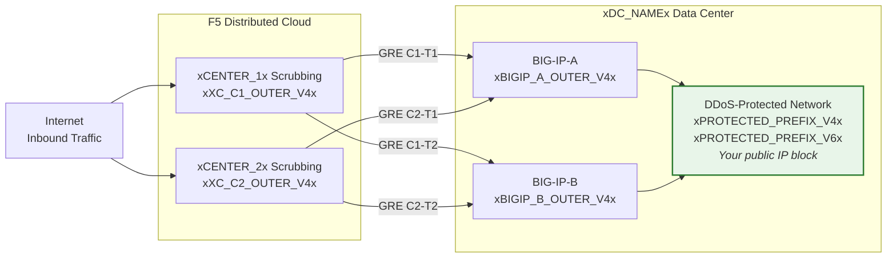
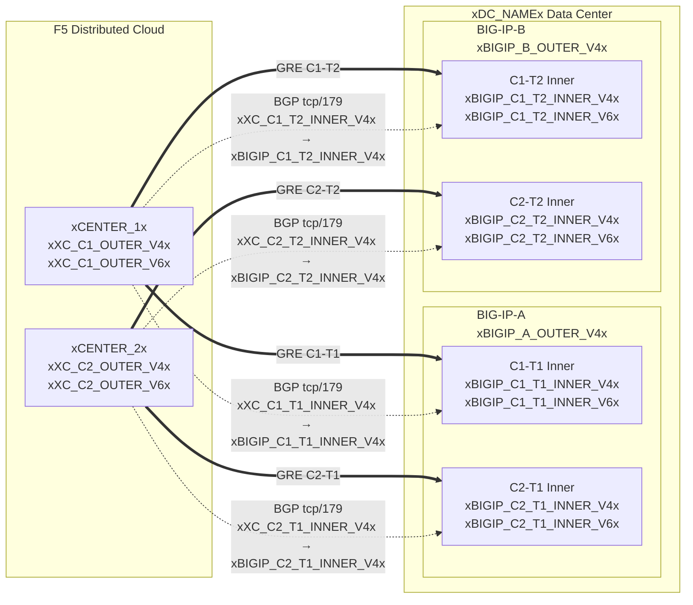

## टोपोलॉजी और पते

**xDC_NAMEx** डेटा सेंटर के लिए कॉन्फ़िगरेशन
जो Cloud स्क्रबिंग सेंटरों से कनेक्ट हो रहा है।

:::note
**ये उदाहरण मान हैं।** ऊपर दी गई तालिकाओं का उपयोग करके ग्राहक-विशिष्ट और
SOC द्वारा प्रदान किए गए मानों से बदलें।

संरक्षित प्रीफ़िक्स **सार्वजनिक रूप से रूटेबल होने चाहिए** (गैर-RFC 1918)।
GRE आउटर एंडपॉइंट IP भी सार्वजनिक रूप से रूटेबल होने चाहिए जब टनल
सार्वजनिक इंटरनेट से गुज़रती हैं; निजी कनेक्टिविटी (L2, प्राइवेट
पीयरिंग) RFC 1918 एंडपॉइंट की अनुमति दे सकती है। उचित डॉक्यूमेंटेशन
पतों का उपयोग करने वाले उदाहरणों के लिए
[K000147949](https://my.f5.com/manage/s/article/K000147949) देखें।

रिडंडेंसी के लिए, **प्रति BIG-IP यूनिट 2 टनल** अलग-अलग
भौगोलिक स्थानों पर स्थित स्क्रबिंग सेंटरों से बनाएं (HA जोड़ी के लिए कुल 4 टनल)।
:::

## वर्कशीट

टनल कॉन्फ़िगरेशन बनाते समय निम्नलिखित XC और BIG-IP वर्कशीट को संदर्भ के रूप में उपयोग करें।

### XC

**टनल C1-T1 — सेंटर 1 से BIG-IP-A:**

- GRE आउटर IP (टनल एंडपॉइंट के लिए):
    - IPv4 SRC: `xXC_C1_OUTER_V4x/24`
    - IPv4 DST: `xBIGIP_A_OUTER_V4x/24`
    - IPv6 SRC: `xXC_C1_OUTER_V6x/64`
    - IPv6 DST: `xBIGIP_A_OUTER_V6x/64`

- GRE इनर IP (BGP सत्र के लिए):
    - IPv4: `xXC_C1_T1_INNER_V4x/30`
    - IPv6: `xXC_C1_T1_INNER_V6x/64`

**टनल C1-T2 — सेंटर 1 से BIG-IP-B:**

- GRE आउटर IP (टनल एंडपॉइंट के लिए):
    - IPv4 SRC: `xXC_C1_OUTER_V4x/24`
    - IPv4 DST: `xBIGIP_B_OUTER_V4x/24`
    - IPv6 SRC: `xXC_C1_OUTER_V6x/64`
    - IPv6 DST: `xBIGIP_B_OUTER_V6x/64`

- GRE इनर IP (BGP सत्र के लिए):
    - IPv4: `xXC_C1_T2_INNER_V4x/30`
    - IPv6: `xXC_C1_T2_INNER_V6x/64`

**टनल C2-T1 — सेंटर 2 से BIG-IP-A:**

- GRE आउटर IP (टनल एंडपॉइंट के लिए):
    - IPv4 SRC: `xXC_C2_OUTER_V4x/24`
    - IPv4 DST: `xBIGIP_A_OUTER_V4x/24`
    - IPv6 SRC: `xXC_C2_OUTER_V6x/64`
    - IPv6 DST: `xBIGIP_A_OUTER_V6x/64`

- GRE इनर IP (BGP सत्र के लिए):
    - IPv4: `xXC_C2_T1_INNER_V4x/30`
    - IPv6: `xXC_C2_T1_INNER_V6x/64`

**टनल C2-T2 — सेंटर 2 से BIG-IP-B:**

- GRE आउटर IP (टनल एंडपॉइंट के लिए):
    - IPv4 SRC: `xXC_C2_OUTER_V4x/24`
    - IPv4 DST: `xBIGIP_B_OUTER_V4x/24`
    - IPv6 SRC: `xXC_C2_OUTER_V6x/64`
    - IPv6 DST: `xBIGIP_B_OUTER_V6x/64`

- GRE इनर IP (BGP सत्र के लिए):
    - IPv4: `xXC_C2_T2_INNER_V4x/30`
    - IPv6: `xXC_C2_T2_INNER_V6x/64`

:::note[इनर (ट्रांज़िट) IP]
इनर IP जैसे `10.10.10.0/30` RFC 1918 पतों का उपयोग करते हैं। यह
सही है क्योंकि वे GRE टनल के अंदर एनकैप्सुलेटेड होते हैं और कभी
सार्वजनिक इंटरनेट पर दिखाई नहीं देते। संरक्षित प्रीफ़िक्स हमेशा
सार्वजनिक रूप से रूटेबल होने चाहिए; आउटर एंडपॉइंट IP सार्वजनिक रूप से रूटेबल होने चाहिए जब
टनल सार्वजनिक इंटरनेट से गुज़रती हैं।
:::

:::note[IPv6 इनर लिंक]
IPv6 इनर लिंक यहाँ सामान्य Cloud डिफ़ॉल्ट से मिलान करने के लिए /64 प्रीफ़िक्स का उपयोग करते हैं। पॉइंट-टू-पॉइंट लिंक के लिए, नेबर-डिस्कवरी एग्ज़ॉस्टन से बचने के लिए
[RFC 6164](https://datatracker.ietf.org/doc/html/rfc6164) के अनुसार /127 को प्राथमिकता दी जाती है। यदि SOC टनल असाइनमेंट इसका समर्थन करता है तो /127 का उपयोग करें।
:::

### BIG-IP

**BIG-IP-A** (आउटर IP `xBIGIP_A_OUTER_V4x` / `xBIGIP_A_OUTER_V6x`):

- GRE आउटर IP:
    - IPv4 SRC: `xBIGIP_A_OUTER_V4x/24`
    - IPv4 DST (सेंटर 1): `xXC_C1_OUTER_V4x/24`
    - IPv4 DST (सेंटर 2): `xXC_C2_OUTER_V4x/24`
    - IPv6 SRC: `xBIGIP_A_OUTER_V6x/64`
    - IPv6 DST (सेंटर 1): `xXC_C1_OUTER_V6x/64`
    - IPv6 DST (सेंटर 2): `xXC_C2_OUTER_V6x/64`

- GRE इनर IP — टनल C1-T1:
    - IPv4: `xBIGIP_C1_T1_INNER_V4x/30`
    - IPv6: `xBIGIP_C1_T1_INNER_V6x/64`

- GRE इनर IP — टनल C2-T1:
    - IPv4: `xBIGIP_C2_T1_INNER_V4x/30`
    - IPv6: `xBIGIP_C2_T1_INNER_V6x/64`

**BIG-IP-B** (आउटर IP `xBIGIP_B_OUTER_V4x` / `xBIGIP_B_OUTER_V6x`):

- GRE आउटर IP:
    - IPv4 SRC: `xBIGIP_B_OUTER_V4x/24`
    - IPv4 DST (सेंटर 1): `xXC_C1_OUTER_V4x/24`
    - IPv4 DST (सेंटर 2): `xXC_C2_OUTER_V4x/24`
    - IPv6 SRC: `xBIGIP_B_OUTER_V6x/64`
    - IPv6 DST (सेंटर 1): `xXC_C1_OUTER_V6x/64`
    - IPv6 DST (सेंटर 2): `xXC_C2_OUTER_V6x/64`

- GRE इनर IP — टनल C1-T2:
    - IPv4: `xBIGIP_C1_T2_INNER_V4x/30`
    - IPv6: `xBIGIP_C1_T2_INNER_V6x/64`

- GRE इनर IP — टनल C2-T2:
    - IPv4: `xBIGIP_C2_T2_INNER_V4x/30`
    - IPv6: `xBIGIP_C2_T2_INNER_V6x/64`

- संरक्षित प्रीफ़िक्स (Cloud को एडवर्टाइज़ किए गए):
    - IPv4: `xPROTECTED_NET_V4xxPROTECTED_CIDR_V4x`
    - IPv6: `xPROTECTED_PREFIX_V6x`

### विस्तृत टोपोलॉजी आरेख

