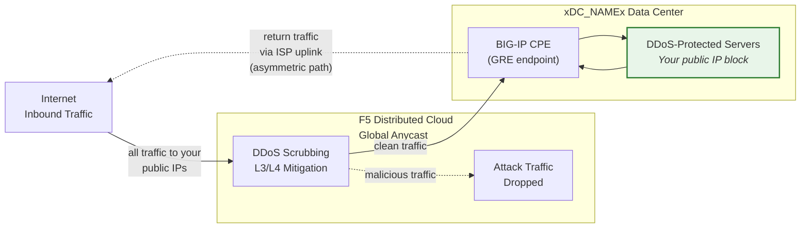
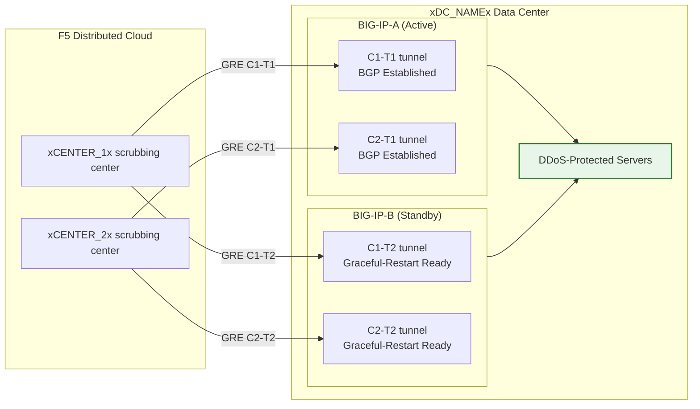

## Cloud GRE/BGP BIG-IP

- Configurare **tunnel GRE** e **peering BGP** da una coppia BIG-IP HA
  (che agisce come apparecchiatura presso i locali del cliente, CPE), con tunnel
  indipendenti per unità.
- Connettiti ai centri di scrubbing **Cloud DDoS Mitigation** in
  **modalità routed** (L3/L4).

## Requisiti

- Servizio **L3/L4 Routed DDoS Mitigation** Cloud
  (Always On o Always Available) abilitato per il tenant.
- BIG-IP con:
    - LTM (o moduli di rete equivalenti).
    - **Routing dinamico (BGP)** con licenza abilitata.
- Modalità routed: almeno un prefisso **/24 (o più corto) pubblicamente
  annunciato** per la protezione (il minimo IPv6 è **/48**).
    - I prefissi protetti **devono essere pubblicamente instradabili** (non RFC 1918).
      Anche gli endpoint esterni GRE devono essere pubblicamente instradabili quando i tunnel
      attraversano Internet pubblico; le distribuzioni che utilizzano connettività privata
      (L2, peering privato) possono utilizzare indirizzi endpoint RFC 1918.
- Connettività tra il data center/router e i centri di scrubbing
  Cloud.

## Architettura HA

Il BIG-IP è distribuito come **coppia HA attivo/standby**, ogni unità
ottiene i propri tunnel GRE indipendenti e sessioni BGP verso ogni
centro di scrubbing:

- **Endpoint tunnel indipendenti**: Ogni unità BIG-IP ha il proprio
  self IP esterno non mobile (`traffic-group-local-only`) e il proprio
  set di tunnel GRE. BIG-IP-A utilizza `xBIGIP_A_OUTER_V4x` e
  BIG-IP-B utilizza `xBIGIP_B_OUTER_V4x` come endpoint dei tunnel. Ciò evita
  la dipendenza da un IP mobile per la sorgente del tunnel.
- **Sessioni BGP indipendenti**: Ogni unità gestisce le proprie sessioni BGP
  sui propri tunnel. BIG-IP-A esegue il peering con C1-T1 e C2-T1;
  BIG-IP-B esegue il peering con C1-T2 e C2-T2. In caso di failover, le sessioni
  BGP dell'unità standby sono già stabilite, quindi il Cloud può
  spostare il traffico immediatamente.
- **Sincronizzazione della configurazione**: Le configurazioni di tunnel, self IP e routing
  vengono sincronizzate tra le unità tramite **config-sync**. Poiché la configurazione
  BGP `imish` è per unità, ogni unità mantiene le proprie istruzioni neighbor.
  Verificare che la sincronizzazione includa tutti gli oggetti tmsh.
- **Comportamento BGP attivo/standby**: L'unità attiva annuncia i prefissi protetti
  con attributi BGP normali. L'unità standby può annunciare gli stessi prefissi
  con un AS-path prepend più lungo (rendendoli meno preferiti) oppure sopprimere
  gli annunci fino al failover. Coordinarsi con il SOC sull'approccio da adottare.
- **Convergenza in caso di failover**: Con `graceful-restart` abilitato e
  tunnel indipendenti, la nuova unità attiva dispone già di sessioni BGP stabilite.
  La convergenza dipende dalla selezione del best-path BGP che si sposta sugli
  annunci dell'unità appena attiva. Effettuare un test con
  `run sys failover standby`.

:::note
Il modello HA con tunnel indipendenti descritto sopra è l'approccio consigliato
per la ridondanza dei dispositivi lato cliente. Valida il design specifico del
failover con il tuo account team prima di andare in produzione, in particolare
riguardo alla strategia di AS-path prepend e ai tempi di riconvergenza BGP.
:::
