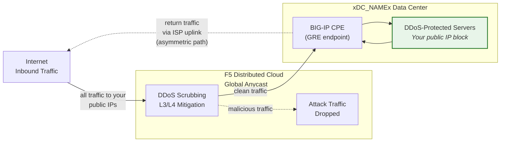
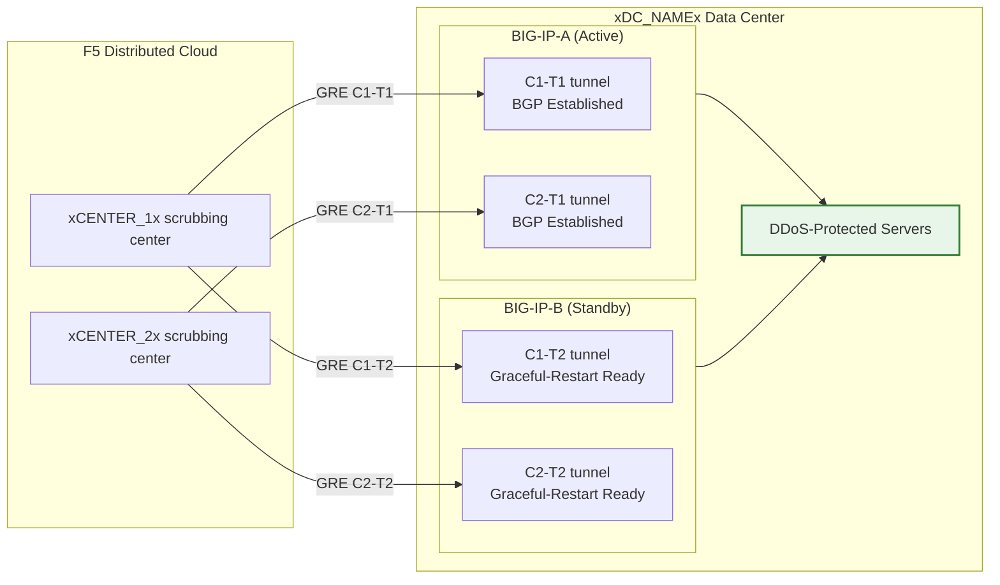

## Cloud GRE/BGP BIG-IP

- Configurare i **tunnel GRE** e il **peering BGP** da una coppia BIG-IP HA
  (che funge da customer premises equipment, CPE), con tunnel
  indipendenti per ciascuna unità.
- Connettersi ai centri di scrubbing **Cloud DDoS Mitigation**
  in **modalità routed** (L3/L4).

## Requisiti

- Servizio Cloud **L3/L4 Routed DDoS Mitigation**
  (Always On o Always Available) abilitato per il proprio tenant.
- BIG-IP con:
    - LTM (o moduli di networking equivalenti).
    - **Routing dinamico (BGP)** con licenza e abilitato.
- Modalità routed: almeno un prefisso **pubblicizzato pubblicamente /24 (o più corto)**
  per la protezione (il minimo IPv6 è **/48**).
    - I prefissi protetti **devono essere pubblicamente instradabili** (non RFC 1918).
     Gli endpoint esterni GRE devono anch'essi essere pubblicamente instradabili quando i tunnel
     attraversano la rete Internet pubblica; le implementazioni che utilizzano connettività
     privata (L2, peering privato) possono usare indirizzi endpoint
     RFC 1918.
- Connettività tra il proprio data center/router e
  il/i centro/i di scrubbing Cloud.

## Architettura HA

Il BIG-IP è implementato come **coppia HA active/standby**, ciascuna unità
dispone dei propri tunnel GRE indipendenti e sessioni BGP verso ogni
centro di scrubbing:

- **Endpoint tunnel indipendenti**: Ciascuna unità BIG-IP dispone del proprio
  self IP esterno non flottante (`traffic-group-local-only`) e del
  proprio set di tunnel GRE. BIG-IP-A utilizza `xBIGIP_A_OUTER_V4x` e
  BIG-IP-B utilizza `xBIGIP_B_OUTER_V4x` come endpoint dei tunnel. Questo evita
  la dipendenza da un IP flottante per l'origine dei tunnel.
- **Sessioni BGP indipendenti**: Ciascuna unità esegue le proprie sessioni BGP
  attraverso i propri tunnel. BIG-IP-A effettua il peering con C1-T1 e C2-T1;
  BIG-IP-B effettua il peering con C1-T2 e C2-T2. In caso di failover le sessioni
  BGP dell'unità standby sono già stabilite, quindi il
  Cloud può spostare il traffico immediatamente.
- **Config sync**: Le configurazioni di tunnel, self IP e routing sono
  sincronizzate tra le unità tramite **config-sync**. Poiché la configurazione
  BGP `imish` è per unità, ciascuna unità mantiene le proprie
  dichiarazioni neighbor. Verificare che la sincronizzazione includa tutti gli oggetti tmsh.
- **Comportamento BGP active/standby**: L'unità attiva pubblicizza
  i prefissi protetti con attributi BGP normali. L'unità standby
  può pubblicizzare gli stessi prefissi con un AS-path
  prepend più lungo (rendendola meno preferita) o sopprimere le pubblicizzazioni
  fino al failover. Coordinare l'approccio con il SOC.
- **Convergenza del failover**: Con `graceful-restart` abilitato e
  tunnel indipendenti, la nuova unità attiva dispone già di sessioni
  BGP stabilite. La convergenza dipende dallo spostamento della selezione BGP best-path
  verso le pubblicizzazioni della nuova unità attiva. Testare con
  `run sys failover standby`.

:::note
Il modello HA con tunnel indipendenti descritto sopra è l'approccio raccomandato
per la ridondanza dei dispositivi lato cliente. Validare la propria specifica
architettura di failover con il team di account prima di passare in
produzione, in particolare per quanto riguarda la strategia di AS-path prepend e
i tempi di riconvergenza BGP.
:::
