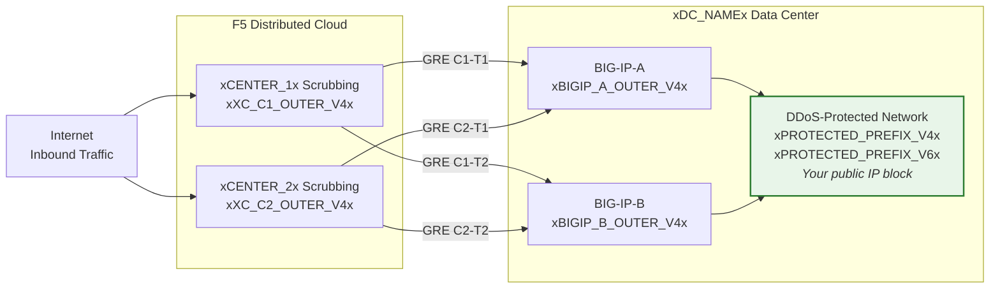
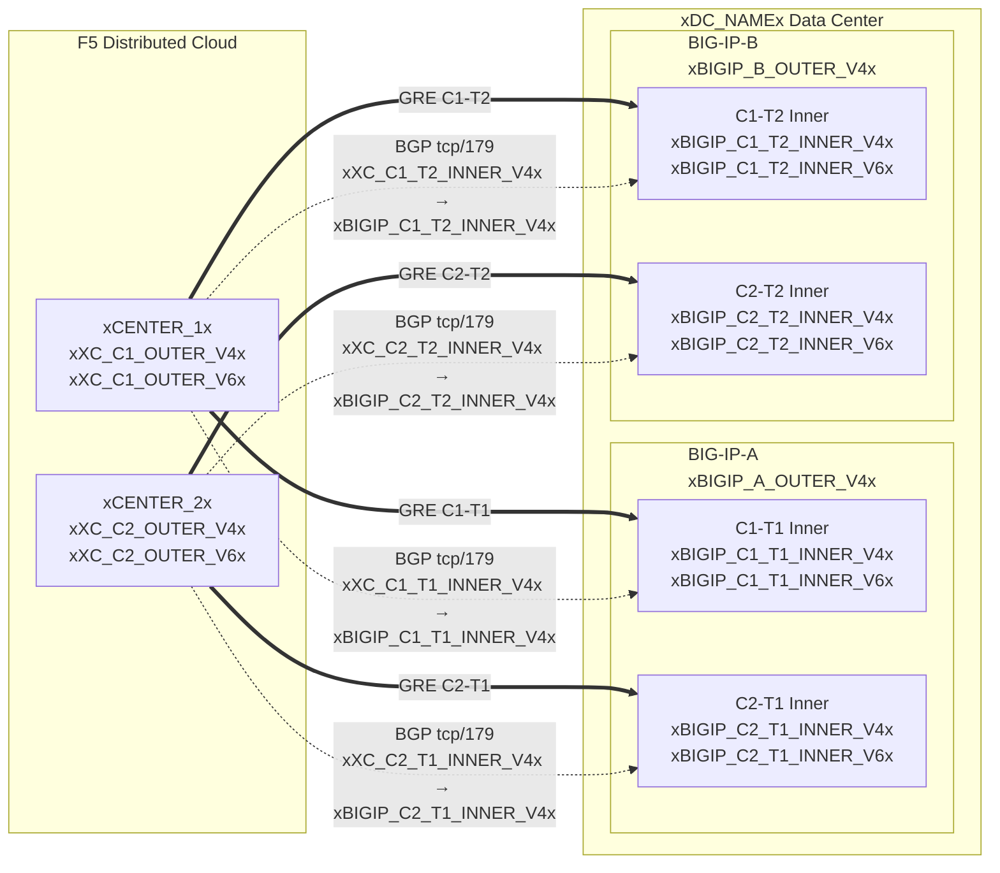

## Topologia e indirizzi

Configurazione per il data center **xDC_NAMEx**
con connessione ai centri di scrubbing Cloud.

:::note
**Questi sono valori di esempio.** Sostituirli con valori specifici del cliente e
forniti dal SOC utilizzando le tabelle sopra.

I prefissi protetti **devono essere instradabili pubblicamente** (non RFC 1918).
Gli IP degli endpoint esterni GRE devono essere anch'essi instradabili pubblicamente quando i tunnel
attraversano la rete Internet pubblica; la connettività privata (L2, peering
privato) può consentire endpoint RFC 1918. Vedere
[K000147949](https://my.f5.com/manage/s/article/K000147949) per esempi che utilizzano indirizzi di documentazione appropriati.

Per la ridondanza, creare **2 tunnel per unità BIG-IP** verso diversi
centri di scrubbing geo-localizzati (4 tunnel totali per una coppia HA).
:::

## Schede di lavoro

Utilizzare le seguenti schede di lavoro XC e BIG-IP come riferimento durante la creazione della configurazione dei tunnel.

### XC

**Tunnel C1-T1 — Center 1 verso BIG-IP-A:**

- IP esterni GRE (per gli endpoint del tunnel):
    - IPv4 SRC: `xXC_C1_OUTER_V4x/24`
    - IPv4 DST: `xBIGIP_A_OUTER_V4x/24`
    - IPv6 SRC: `xXC_C1_OUTER_V6x/64`
    - IPv6 DST: `xBIGIP_A_OUTER_V6x/64`

- IP interni GRE (per la sessione BGP):
    - IPv4: `xXC_C1_T1_INNER_V4x/30`
    - IPv6: `xXC_C1_T1_INNER_V6x/64`

**Tunnel C1-T2 — Center 1 verso BIG-IP-B:**

- IP esterni GRE (per gli endpoint del tunnel):
    - IPv4 SRC: `xXC_C1_OUTER_V4x/24`
    - IPv4 DST: `xBIGIP_B_OUTER_V4x/24`
    - IPv6 SRC: `xXC_C1_OUTER_V6x/64`
    - IPv6 DST: `xBIGIP_B_OUTER_V6x/64`

- IP interni GRE (per la sessione BGP):
    - IPv4: `xXC_C1_T2_INNER_V4x/30`
    - IPv6: `xXC_C1_T2_INNER_V6x/64`

**Tunnel C2-T1 — Center 2 verso BIG-IP-A:**

- IP esterni GRE (per gli endpoint del tunnel):
    - IPv4 SRC: `xXC_C2_OUTER_V4x/24`
    - IPv4 DST: `xBIGIP_A_OUTER_V4x/24`
    - IPv6 SRC: `xXC_C2_OUTER_V6x/64`
    - IPv6 DST: `xBIGIP_A_OUTER_V6x/64`

- IP interni GRE (per la sessione BGP):
    - IPv4: `xXC_C2_T1_INNER_V4x/30`
    - IPv6: `xXC_C2_T1_INNER_V6x/64`

**Tunnel C2-T2 — Center 2 verso BIG-IP-B:**

- IP esterni GRE (per gli endpoint del tunnel):
    - IPv4 SRC: `xXC_C2_OUTER_V4x/24`
    - IPv4 DST: `xBIGIP_B_OUTER_V4x/24`
    - IPv6 SRC: `xXC_C2_OUTER_V6x/64`
    - IPv6 DST: `xBIGIP_B_OUTER_V6x/64`

- IP interni GRE (per la sessione BGP):
    - IPv4: `xXC_C2_T2_INNER_V4x/30`
    - IPv6: `xXC_C2_T2_INNER_V6x/64`

:::note[IP interni (di transito)]
Gli IP interni come `10.10.10.0/30` utilizzano indirizzi RFC 1918. Questo è
corretto perché sono incapsulati all'interno del tunnel GRE e non
appaiono mai sulla rete Internet pubblica. I prefissi protetti devono essere sempre
instradabili pubblicamente; gli IP degli endpoint esterni devono essere instradabili pubblicamente quando
i tunnel attraversano la rete Internet pubblica.
:::

:::note[Link interni IPv6]
I link interni IPv6 utilizzano qui prefissi /64 per corrispondere alle impostazioni
predefinite comuni del Cloud. Per i link punto-punto, /127 è preferito secondo
[RFC 6164](https://datatracker.ietf.org/doc/html/rfc6164) per evitare l'esaurimento del neighbor-discovery. Utilizzare /127
se l'assegnazione del tunnel del SOC lo supporta.
:::

### BIG-IP

**BIG-IP-A** (IP esterno `xBIGIP_A_OUTER_V4x` / `xBIGIP_A_OUTER_V6x`):

- IP esterni GRE:
    - IPv4 SRC: `xBIGIP_A_OUTER_V4x/24`
    - IPv4 DST (Center 1): `xXC_C1_OUTER_V4x/24`
    - IPv4 DST (Center 2): `xXC_C2_OUTER_V4x/24`
    - IPv6 SRC: `xBIGIP_A_OUTER_V6x/64`
    - IPv6 DST (Center 1): `xXC_C1_OUTER_V6x/64`
    - IPv6 DST (Center 2): `xXC_C2_OUTER_V6x/64`

- IP interni GRE — Tunnel C1-T1:
    - IPv4: `xBIGIP_C1_T1_INNER_V4x/30`
    - IPv6: `xBIGIP_C1_T1_INNER_V6x/64`

- IP interni GRE — Tunnel C2-T1:
    - IPv4: `xBIGIP_C2_T1_INNER_V4x/30`
    - IPv6: `xBIGIP_C2_T1_INNER_V6x/64`

**BIG-IP-B** (IP esterno `xBIGIP_B_OUTER_V4x` / `xBIGIP_B_OUTER_V6x`):

- IP esterni GRE:
    - IPv4 SRC: `xBIGIP_B_OUTER_V4x/24`
    - IPv4 DST (Center 1): `xXC_C1_OUTER_V4x/24`
    - IPv4 DST (Center 2): `xXC_C2_OUTER_V4x/24`
    - IPv6 SRC: `xBIGIP_B_OUTER_V6x/64`
    - IPv6 DST (Center 1): `xXC_C1_OUTER_V6x/64`
    - IPv6 DST (Center 2): `xXC_C2_OUTER_V6x/64`

- IP interni GRE — Tunnel C1-T2:
    - IPv4: `xBIGIP_C1_T2_INNER_V4x/30`
    - IPv6: `xBIGIP_C1_T2_INNER_V6x/64`

- IP interni GRE — Tunnel C2-T2:
    - IPv4: `xBIGIP_C2_T2_INNER_V4x/30`
    - IPv6: `xBIGIP_C2_T2_INNER_V6x/64`

- Prefissi protetti (annunciati al Cloud):
    - IPv4: `xPROTECTED_NET_V4xxPROTECTED_CIDR_V4x`
    - IPv6: `xPROTECTED_PREFIX_V6x`

### Diagramma di topologia dettagliato

