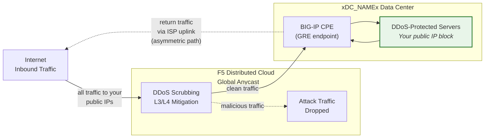
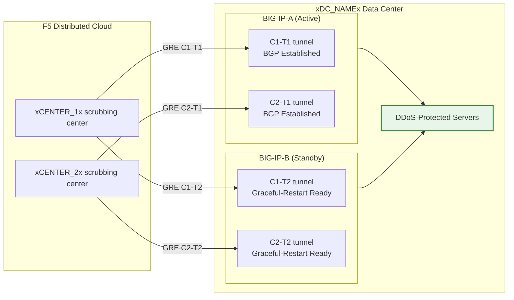

## Cloud GRE/BGP BIG-IP

- BIG-IP HAペア（カスタマープレミスイクイップメント（CPE）として機能）から、ユニットごとに独立したトンネルを使用して**GREトンネル**と**BGPピアリング**を設定します。
- **ルーテッドモード**（L3/L4）で**Cloud DDoSミティゲーション**スクラビングセンターに接続します。

## 要件

- テナントで有効化されたCloud **L3/L4ルーテッドDDoSミティゲーション**サービス（Always OnまたはAlways Available）。
- 以下を備えたBIG-IP：
    - LTM（または同等のネットワーキングモジュール）。
    - **ダイナミックルーティング（BGP）**のライセンスおよび有効化。
- ルーテッドモード：保護対象として少なくとも1つの**パブリックにアドバタイズされた/24（またはそれより短い）**プレフィックス（IPv6の最小は**/48**）。
    - 保護対象プレフィックスは**パブリックにルーティング可能**（非RFC 1918）である必要があります。トンネルがパブリックインターネットを経由する場合、GREの外部エンドポイントもパブリックにルーティング可能である必要があります。プライベート接続（L2、プライベートピアリング）を使用するデプロイメントでは、RFC 1918のエンドポイントアドレスを使用できます。
- データセンター/ルーターとCloudスクラビングセンター間の接続性。

## HAアーキテクチャ

BIG-IPは**アクティブ/スタンバイHAペア**としてデプロイされ、各ユニットはすべてのスクラビングセンターに対して独自の独立したGREトンネルとBGPセッションを持ちます：

- **独立したトンネルエンドポイント**：各BIG-IPユニットは独自の非フローティング外部セルフIP（`traffic-group-local-only`）と独自のGREトンネルセットを持ちます。BIG-IP-Aは`xBIGIP_A_OUTER_V4x`を、BIG-IP-Bは`xBIGIP_B_OUTER_V4x`をトンネルエンドポイントとして使用します。これにより、トンネルソーシングにおけるフローティングIPへの依存を回避します。
- **独立したBGPセッション**：各ユニットは独自のトンネル上で独自のBGPセッションを実行します。BIG-IP-AはC1-T1およびC2-T1とピアリングし、BIG-IP-BはC1-T2およびC2-T2とピアリングします。フェイルオーバー時にスタンバイユニットのBGPセッションはすでに確立されているため、Cloudは即座にトラフィックをシフトできます。
- **設定同期**：トンネル、セルフIP、およびルーティング設定は**config-sync**を介してユニット間で同期されます。`imish` BGP設定はユニットごとであるため、各ユニットは独自のneighborステートメントを維持します。同期にすべてのtmshオブジェクトが含まれていることを確認してください。
- **アクティブ/スタンバイBGP動作**：アクティブユニットは通常のBGP属性で保護対象プレフィックスをアドバタイズします。スタンバイユニットは、より長いAS-pathプリペンドで同じプレフィックスをアドバタイズする（優先度を下げる）か、フェイルオーバーまでアドバタイズメントを抑制できます。アプローチについてはSOCと調整してください。
- **フェイルオーバーコンバージェンス**：`graceful-restart`が有効で独立したトンネルがある場合、新しいアクティブユニットはすでに確立されたBGPセッションを持っています。コンバージェンスは、BGPベストパス選択が新しいアクティブユニットのアドバタイズメントにシフトすることに依存します。`run sys failover standby`でテストしてください。

:::note
上記の独立トンネルHAモデルは、カスタマー側のデバイス冗長性に推奨されるアプローチです。特にAS-pathプリペンド戦略とBGPリコンバージェンスタイミングについて、本番環境に移行する前にアカウントチームと具体的なフェイルオーバー設計を検証してください。
:::
