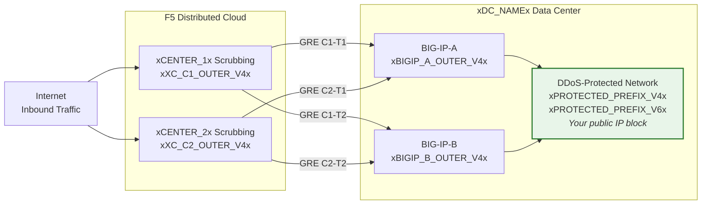
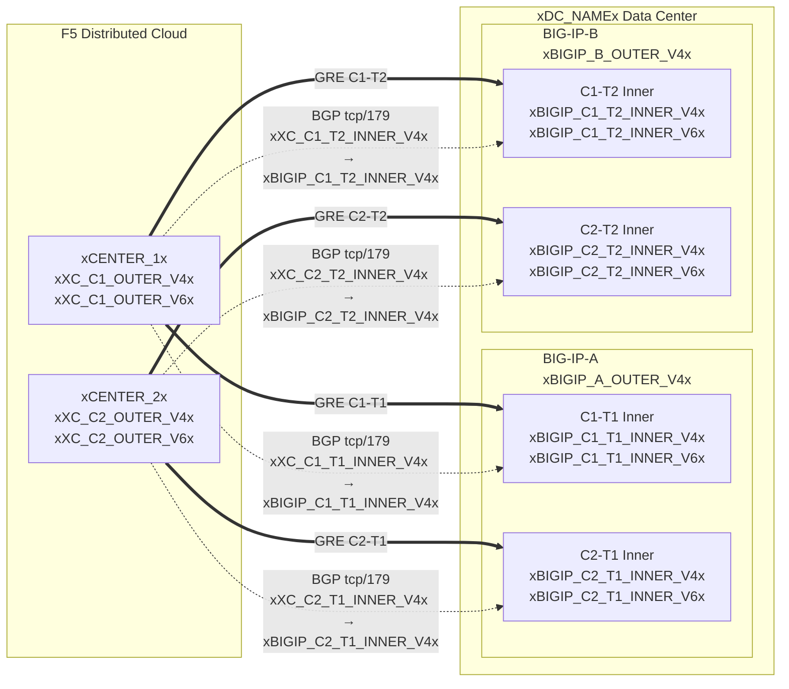

## トポロジーとアドレス

Cloudスクラビングセンターに接続する **xDC_NAMEx** データセンターの構成。

:::note
**これらは例の値です。** 上記の表を使用して、顧客固有の値およびSOCから提供された値に置き換えてください。

保護対象プレフィックスは **パブリックにルーティング可能** である必要があります（RFC 1918以外）。
GREアウターエンドポイントIPも、トンネルがパブリックインターネットを経由する場合はパブリックにルーティング可能である必要があります。プライベート接続（L2、プライベートピアリング）ではRFC 1918エンドポイントが許可される場合があります。適切なドキュメントアドレスを使用した例については、[K000147949](https://my.f5.com/manage/s/article/K000147949) を参照してください。

冗長性のために、**BIG-IPユニットごとに2つのトンネル** を異なる地理的に分散されたスクラビングセンターに作成します（HAペアの場合、合計4トンネル）。
:::

## ワークシート

トンネル構成を作成する際の参考として、以下のXCおよびBIG-IPワークシートを使用してください。

### XC

**トンネル C1-T1 — センター1からBIG-IP-A:**

- GREアウターIP（トンネルエンドポイント用）:
    - IPv4 SRC: `xXC_C1_OUTER_V4x/24`
    - IPv4 DST: `xBIGIP_A_OUTER_V4x/24`
    - IPv6 SRC: `xXC_C1_OUTER_V6x/64`
    - IPv6 DST: `xBIGIP_A_OUTER_V6x/64`

- GREインナーIP（BGPセッション用）:
    - IPv4: `xXC_C1_T1_INNER_V4x/30`
    - IPv6: `xXC_C1_T1_INNER_V6x/64`

**トンネル C1-T2 — センター1からBIG-IP-B:**

- GREアウターIP（トンネルエンドポイント用）:
    - IPv4 SRC: `xXC_C1_OUTER_V4x/24`
    - IPv4 DST: `xBIGIP_B_OUTER_V4x/24`
    - IPv6 SRC: `xXC_C1_OUTER_V6x/64`
    - IPv6 DST: `xBIGIP_B_OUTER_V6x/64`

- GREインナーIP（BGPセッション用）:
    - IPv4: `xXC_C1_T2_INNER_V4x/30`
    - IPv6: `xXC_C1_T2_INNER_V6x/64`

**トンネル C2-T1 — センター2からBIG-IP-A:**

- GREアウターIP（トンネルエンドポイント用）:
    - IPv4 SRC: `xXC_C2_OUTER_V4x/24`
    - IPv4 DST: `xBIGIP_A_OUTER_V4x/24`
    - IPv6 SRC: `xXC_C2_OUTER_V6x/64`
    - IPv6 DST: `xBIGIP_A_OUTER_V6x/64`

- GREインナーIP（BGPセッション用）:
    - IPv4: `xXC_C2_T1_INNER_V4x/30`
    - IPv6: `xXC_C2_T1_INNER_V6x/64`

**トンネル C2-T2 — センター2からBIG-IP-B:**

- GREアウターIP（トンネルエンドポイント用）:
    - IPv4 SRC: `xXC_C2_OUTER_V4x/24`
    - IPv4 DST: `xBIGIP_B_OUTER_V4x/24`
    - IPv6 SRC: `xXC_C2_OUTER_V6x/64`
    - IPv6 DST: `xBIGIP_B_OUTER_V6x/64`

- GREインナーIP（BGPセッション用）:
    - IPv4: `xXC_C2_T2_INNER_V4x/30`
    - IPv6: `xXC_C2_T2_INNER_V6x/64`

:::note[インナー（トランジット）IP]
`10.10.10.0/30` のようなインナーIPはRFC 1918アドレスを使用します。これは、GREトンネル内にカプセル化されパブリックインターネット上に現れることがないため、正しい設定です。保護対象プレフィックスは常にパブリックにルーティング可能である必要があります。アウターエンドポイントIPは、トンネルがパブリックインターネットを経由する場合、パブリックにルーティング可能である必要があります。
:::

:::note[IPv6インナーリンク]
ここではIPv6インナーリンクに一般的なCloudのデフォルトに合わせて/64プレフィックスを使用しています。ポイントツーポイントリンクの場合、近隣探索の枯渇を避けるために[RFC 6164](https://datatracker.ietf.org/doc/html/rfc6164)に従い/127が推奨されます。SOCのトンネル割り当てがサポートしている場合は/127を使用してください。
:::

### BIG-IP

**BIG-IP-A**（アウターIP `xBIGIP_A_OUTER_V4x` / `xBIGIP_A_OUTER_V6x`）:

- GREアウターIP:
    - IPv4 SRC: `xBIGIP_A_OUTER_V4x/24`
    - IPv4 DST（センター1）: `xXC_C1_OUTER_V4x/24`
    - IPv4 DST（センター2）: `xXC_C2_OUTER_V4x/24`
    - IPv6 SRC: `xBIGIP_A_OUTER_V6x/64`
    - IPv6 DST（センター1）: `xXC_C1_OUTER_V6x/64`
    - IPv6 DST（センター2）: `xXC_C2_OUTER_V6x/64`

- GREインナーIP — トンネル C1-T1:
    - IPv4: `xBIGIP_C1_T1_INNER_V4x/30`
    - IPv6: `xBIGIP_C1_T1_INNER_V6x/64`

- GREインナーIP — トンネル C2-T1:
    - IPv4: `xBIGIP_C2_T1_INNER_V4x/30`
    - IPv6: `xBIGIP_C2_T1_INNER_V6x/64`

**BIG-IP-B**（アウターIP `xBIGIP_B_OUTER_V4x` / `xBIGIP_B_OUTER_V6x`）:

- GREアウターIP:
    - IPv4 SRC: `xBIGIP_B_OUTER_V4x/24`
    - IPv4 DST（センター1）: `xXC_C1_OUTER_V4x/24`
    - IPv4 DST（センター2）: `xXC_C2_OUTER_V4x/24`
    - IPv6 SRC: `xBIGIP_B_OUTER_V6x/64`
    - IPv6 DST（センター1）: `xXC_C1_OUTER_V6x/64`
    - IPv6 DST（センター2）: `xXC_C2_OUTER_V6x/64`

- GREインナーIP — トンネル C1-T2:
    - IPv4: `xBIGIP_C1_T2_INNER_V4x/30`
    - IPv6: `xBIGIP_C1_T2_INNER_V6x/64`

- GREインナーIP — トンネル C2-T2:
    - IPv4: `xBIGIP_C2_T2_INNER_V4x/30`
    - IPv6: `xBIGIP_C2_T2_INNER_V6x/64`

- 保護対象プレフィックス（Cloudにアドバタイズ）:
    - IPv4: `xPROTECTED_NET_V4xxPROTECTED_CIDR_V4x`
    - IPv6: `xPROTECTED_PREFIX_V6x`

### 詳細トポロジー図

