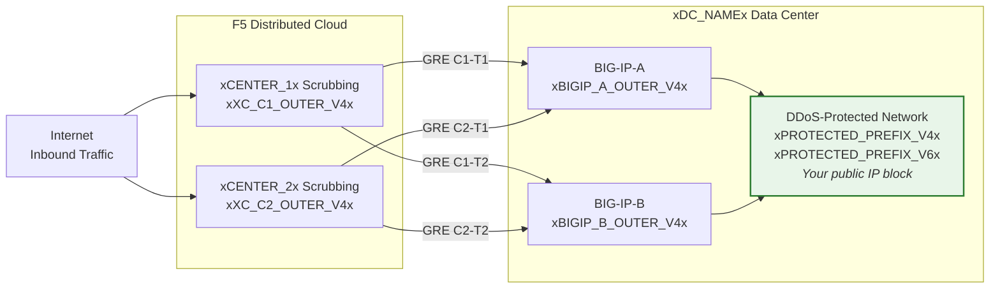
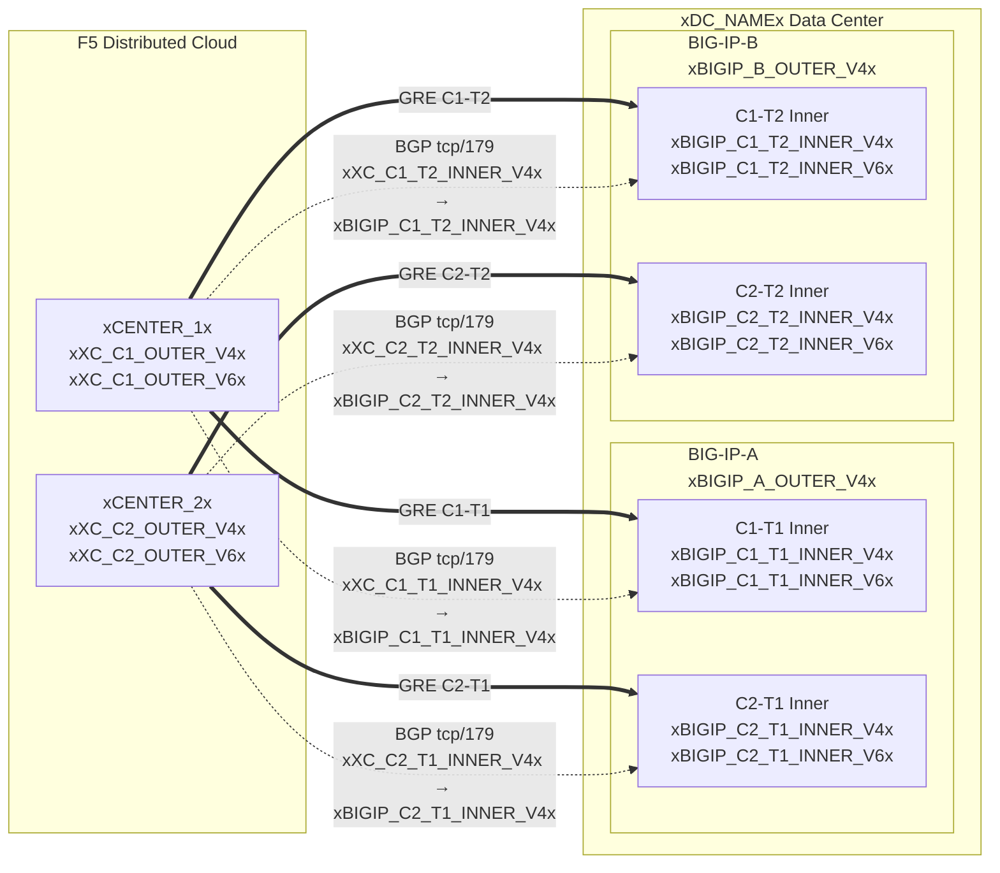

## トポロジーとアドレス

クラウドスクラビングセンターに接続する **xDC_NAMEx** データセンターの設定。

:::note
**これらはサンプル値です。** 上記の表を使用して、お客様固有の値および
SOC 提供の値に置き換えてください。

保護対象プレフィックスは**パブリックルーティング可能**である必要があります（非 RFC 1918）。
GRE 外部エンドポイント IP も、トンネルがパブリックインターネットを経由する場合はパブリックルーティング可能である必要があります。プライベート接続（L2、プライベートピアリング）では RFC 1918 エンドポイントが使用できる場合があります。適切なドキュメントアドレスを使用した例については、
[K000147949](https://my.f5.com/manage/s/article/K000147949) を参照してください。

冗長性のために、異なる地理的ロケーションのスクラビングセンターに対して **BIG-IP ユニットごとに 2 本のトンネルを作成**してください（HA ペアの場合は合計 4 本のトンネル）。
:::

## ワークシート

以下の XC および BIG-IP ワークシートをトンネル設定の構築時に参照してください。

### XC

**トンネル C1-T1 — センター 1 から BIG-IP-A:**

- GRE 外部 IP（トンネルエンドポイント用）:
    - IPv4 SRC: `xXC_C1_OUTER_V4x/24`
    - IPv4 DST: `xBIGIP_A_OUTER_V4x/24`
    - IPv6 SRC: `xXC_C1_OUTER_V6x/64`
    - IPv6 DST: `xBIGIP_A_OUTER_V6x/64`

- GRE 内部 IP（BGP セッション用）:
    - IPv4: `xXC_C1_T1_INNER_V4x/30`
    - IPv6: `xXC_C1_T1_INNER_V6x/64`

**トンネル C1-T2 — センター 1 から BIG-IP-B:**

- GRE 外部 IP（トンネルエンドポイント用）:
    - IPv4 SRC: `xXC_C1_OUTER_V4x/24`
    - IPv4 DST: `xBIGIP_B_OUTER_V4x/24`
    - IPv6 SRC: `xXC_C1_OUTER_V6x/64`
    - IPv6 DST: `xBIGIP_B_OUTER_V6x/64`

- GRE 内部 IP（BGP セッション用）:
    - IPv4: `xXC_C1_T2_INNER_V4x/30`
    - IPv6: `xXC_C1_T2_INNER_V6x/64`

**トンネル C2-T1 — センター 2 から BIG-IP-A:**

- GRE 外部 IP（トンネルエンドポイント用）:
    - IPv4 SRC: `xXC_C2_OUTER_V4x/24`
    - IPv4 DST: `xBIGIP_A_OUTER_V4x/24`
    - IPv6 SRC: `xXC_C2_OUTER_V6x/64`
    - IPv6 DST: `xBIGIP_A_OUTER_V6x/64`

- GRE 内部 IP（BGP セッション用）:
    - IPv4: `xXC_C2_T1_INNER_V4x/30`
    - IPv6: `xXC_C2_T1_INNER_V6x/64`

**トンネル C2-T2 — センター 2 から BIG-IP-B:**

- GRE 外部 IP（トンネルエンドポイント用）:
    - IPv4 SRC: `xXC_C2_OUTER_V4x/24`
    - IPv4 DST: `xBIGIP_B_OUTER_V4x/24`
    - IPv6 SRC: `xXC_C2_OUTER_V6x/64`
    - IPv6 DST: `xBIGIP_B_OUTER_V6x/64`

- GRE 内部 IP（BGP セッション用）:
    - IPv4: `xXC_C2_T2_INNER_V4x/30`
    - IPv6: `xXC_C2_T2_INNER_V6x/64`

:::note[内部（トランジット）IP]
`10.10.10.0/30` などの内部 IP は RFC 1918 アドレスを使用します。これは、
GRE トンネル内にカプセル化されており、パブリックインターネット上には表示されないため、
正しい設定です。保護対象プレフィックスは常にパブリックルーティング可能である必要があり、外部エンドポイント IP もトンネルがパブリックインターネットを経由する場合はパブリックルーティング可能である必要があります。
:::

:::note[IPv6 内部リンク]
IPv6 内部リンクは、一般的なクラウドのデフォルト設定に合わせるため、ここでは /64 プレフィックスを使用しています。ポイントツーポイントリンクでは、ネイバーディスカバリー枯渇を避けるために
[RFC 6164](https://datatracker.ietf.org/doc/html/rfc6164) に従い /127 が推奨されます。SOC のトンネル割り当てがサポートしている場合は /127 を使用してください。
:::

### BIG-IP

**BIG-IP-A**（外部 IP `xBIGIP_A_OUTER_V4x` / `xBIGIP_A_OUTER_V6x`）:

- GRE 外部 IP:
    - IPv4 SRC: `xBIGIP_A_OUTER_V4x/24`
    - IPv4 DST（センター 1）: `xXC_C1_OUTER_V4x/24`
    - IPv4 DST（センター 2）: `xXC_C2_OUTER_V4x/24`
    - IPv6 SRC: `xBIGIP_A_OUTER_V6x/64`
    - IPv6 DST（センター 1）: `xXC_C1_OUTER_V6x/64`
    - IPv6 DST（センター 2）: `xXC_C2_OUTER_V6x/64`

- GRE 内部 IP — トンネル C1-T1:
    - IPv4: `xBIGIP_C1_T1_INNER_V4x/30`
    - IPv6: `xBIGIP_C1_T1_INNER_V6x/64`

- GRE 内部 IP — トンネル C2-T1:
    - IPv4: `xBIGIP_C2_T1_INNER_V4x/30`
    - IPv6: `xBIGIP_C2_T1_INNER_V6x/64`

**BIG-IP-B**（外部 IP `xBIGIP_B_OUTER_V4x` / `xBIGIP_B_OUTER_V6x`）:

- GRE 外部 IP:
    - IPv4 SRC: `xBIGIP_B_OUTER_V4x/24`
    - IPv4 DST（センター 1）: `xXC_C1_OUTER_V4x/24`
    - IPv4 DST（センター 2）: `xXC_C2_OUTER_V4x/24`
    - IPv6 SRC: `xBIGIP_B_OUTER_V6x/64`
    - IPv6 DST（センター 1）: `xXC_C1_OUTER_V6x/64`
    - IPv6 DST（センター 2）: `xXC_C2_OUTER_V6x/64`

- GRE 内部 IP — トンネル C1-T2:
    - IPv4: `xBIGIP_C1_T2_INNER_V4x/30`
    - IPv6: `xBIGIP_C1_T2_INNER_V6x/64`

- GRE 内部 IP — トンネル C2-T2:
    - IPv4: `xBIGIP_C2_T2_INNER_V4x/30`
    - IPv6: `xBIGIP_C2_T2_INNER_V6x/64`

- 保護対象プレフィックス（クラウドへのアドバタイズ）:
    - IPv4: `xPROTECTED_NET_V4xxPROTECTED_CIDR_V4x`
    - IPv6: `xPROTECTED_PREFIX_V6x`

### 詳細トポロジー図

