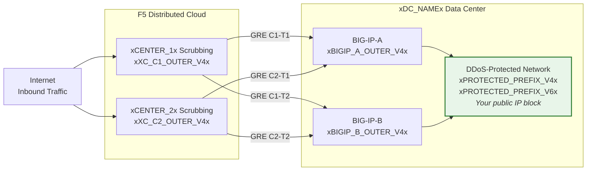
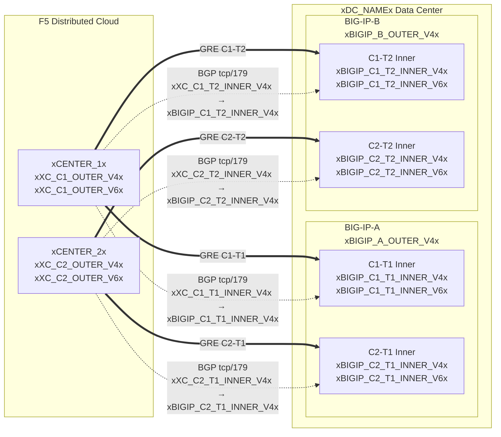

## 토폴로지 및 주소

클라우드 스크러빙 센터에 연결하는 **xDC_NAMEx** 데이터 센터의
구성입니다.

:::note
**이 값들은 예시입니다.** 위의 표를 사용하여 고객별 및
SOC 제공 값으로 교체하십시오.

보호 대상 프리픽스는 **공개적으로 라우팅 가능해야 합니다** (비 RFC 1918).
터널이 공용 인터넷을 통과하는 경우 GRE 외부 엔드포인트 IP도 공개적으로
라우팅 가능해야 합니다. 프라이빗 연결(L2, 프라이빗 피어링)의 경우
RFC 1918 엔드포인트를 사용할 수 있습니다. 적절한 문서 주소를 사용하는
예시는 [K000147949](https://my.f5.com/manage/s/article/K000147949)를 참조하십시오.

이중화를 위해 **BIG-IP 장치당 2개의 터널**을 서로 다른
지리적 위치의 스크러빙 센터에 생성하십시오 (HA 쌍의 경우 총 4개 터널).
:::

## 워크시트

터널 구성을 작성할 때 다음 XC 및 BIG-IP 워크시트를 참조로 사용하십시오.

### XC

**터널 C1-T1 — 센터 1에서 BIG-IP-A로:**

- GRE 외부 IP (터널 엔드포인트용):
    - IPv4 SRC: `xXC_C1_OUTER_V4x/24`
    - IPv4 DST: `xBIGIP_A_OUTER_V4x/24`
    - IPv6 SRC: `xXC_C1_OUTER_V6x/64`
    - IPv6 DST: `xBIGIP_A_OUTER_V6x/64`

- GRE 내부 IP (BGP 세션용):
    - IPv4: `xXC_C1_T1_INNER_V4x/30`
    - IPv6: `xXC_C1_T1_INNER_V6x/64`

**터널 C1-T2 — 센터 1에서 BIG-IP-B로:**

- GRE 외부 IP (터널 엔드포인트용):
    - IPv4 SRC: `xXC_C1_OUTER_V4x/24`
    - IPv4 DST: `xBIGIP_B_OUTER_V4x/24`
    - IPv6 SRC: `xXC_C1_OUTER_V6x/64`
    - IPv6 DST: `xBIGIP_B_OUTER_V6x/64`

- GRE 내부 IP (BGP 세션용):
    - IPv4: `xXC_C1_T2_INNER_V4x/30`
    - IPv6: `xXC_C1_T2_INNER_V6x/64`

**터널 C2-T1 — 센터 2에서 BIG-IP-A로:**

- GRE 외부 IP (터널 엔드포인트용):
    - IPv4 SRC: `xXC_C2_OUTER_V4x/24`
    - IPv4 DST: `xBIGIP_A_OUTER_V4x/24`
    - IPv6 SRC: `xXC_C2_OUTER_V6x/64`
    - IPv6 DST: `xBIGIP_A_OUTER_V6x/64`

- GRE 내부 IP (BGP 세션용):
    - IPv4: `xXC_C2_T1_INNER_V4x/30`
    - IPv6: `xXC_C2_T1_INNER_V6x/64`

**터널 C2-T2 — 센터 2에서 BIG-IP-B로:**

- GRE 외부 IP (터널 엔드포인트용):
    - IPv4 SRC: `xXC_C2_OUTER_V4x/24`
    - IPv4 DST: `xBIGIP_B_OUTER_V4x/24`
    - IPv6 SRC: `xXC_C2_OUTER_V6x/64`
    - IPv6 DST: `xBIGIP_B_OUTER_V6x/64`

- GRE 내부 IP (BGP 세션용):
    - IPv4: `xXC_C2_T2_INNER_V4x/30`
    - IPv6: `xXC_C2_T2_INNER_V6x/64`

:::note[내부 (전송) IP]
`10.10.10.0/30`과 같은 내부 IP는 RFC 1918 주소를 사용합니다. 이는
GRE 터널 내부에 캡슐화되어 공용 인터넷에 노출되지 않으므로
올바른 구성입니다. 보호 대상 프리픽스는 항상 공개적으로 라우팅 가능해야 하며,
터널이 공용 인터넷을 통과하는 경우 외부 엔드포인트 IP도 공개적으로
라우팅 가능해야 합니다.
:::

:::note[IPv6 내부 링크]
여기서 IPv6 내부 링크는 일반적인 클라우드 기본값에 맞추어 /64 프리픽스를
사용합니다. 점대점 링크의 경우 네이버 디스커버리 소진을 방지하기 위해
[RFC 6164](https://datatracker.ietf.org/doc/html/rfc6164)에 따라 /127이 권장됩니다. SOC 터널 할당이
지원하는 경우 /127을 사용하십시오.
:::

### BIG-IP

**BIG-IP-A** (외부 IP `xBIGIP_A_OUTER_V4x` / `xBIGIP_A_OUTER_V6x`):

- GRE 외부 IP:
    - IPv4 SRC: `xBIGIP_A_OUTER_V4x/24`
    - IPv4 DST (센터 1): `xXC_C1_OUTER_V4x/24`
    - IPv4 DST (센터 2): `xXC_C2_OUTER_V4x/24`
    - IPv6 SRC: `xBIGIP_A_OUTER_V6x/64`
    - IPv6 DST (센터 1): `xXC_C1_OUTER_V6x/64`
    - IPv6 DST (센터 2): `xXC_C2_OUTER_V6x/64`

- GRE 내부 IP — 터널 C1-T1:
    - IPv4: `xBIGIP_C1_T1_INNER_V4x/30`
    - IPv6: `xBIGIP_C1_T1_INNER_V6x/64`

- GRE 내부 IP — 터널 C2-T1:
    - IPv4: `xBIGIP_C2_T1_INNER_V4x/30`
    - IPv6: `xBIGIP_C2_T1_INNER_V6x/64`

**BIG-IP-B** (외부 IP `xBIGIP_B_OUTER_V4x` / `xBIGIP_B_OUTER_V6x`):

- GRE 외부 IP:
    - IPv4 SRC: `xBIGIP_B_OUTER_V4x/24`
    - IPv4 DST (센터 1): `xXC_C1_OUTER_V4x/24`
    - IPv4 DST (센터 2): `xXC_C2_OUTER_V4x/24`
    - IPv6 SRC: `xBIGIP_B_OUTER_V6x/64`
    - IPv6 DST (센터 1): `xXC_C1_OUTER_V6x/64`
    - IPv6 DST (센터 2): `xXC_C2_OUTER_V6x/64`

- GRE 내부 IP — 터널 C1-T2:
    - IPv4: `xBIGIP_C1_T2_INNER_V4x/30`
    - IPv6: `xBIGIP_C1_T2_INNER_V6x/64`

- GRE 내부 IP — 터널 C2-T2:
    - IPv4: `xBIGIP_C2_T2_INNER_V4x/30`
    - IPv6: `xBIGIP_C2_T2_INNER_V6x/64`

- 보호 대상 프리픽스 (클라우드에 광고됨):
    - IPv4: `xPROTECTED_NET_V4xxPROTECTED_CIDR_V4x`
    - IPv6: `xPROTECTED_PREFIX_V6x`

### 상세 토폴로지 다이어그램

