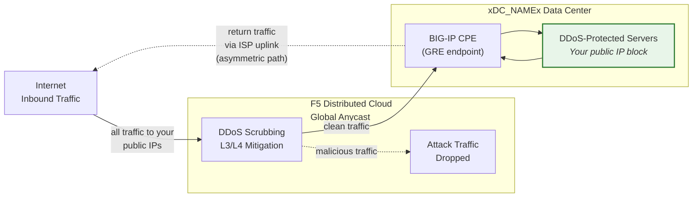
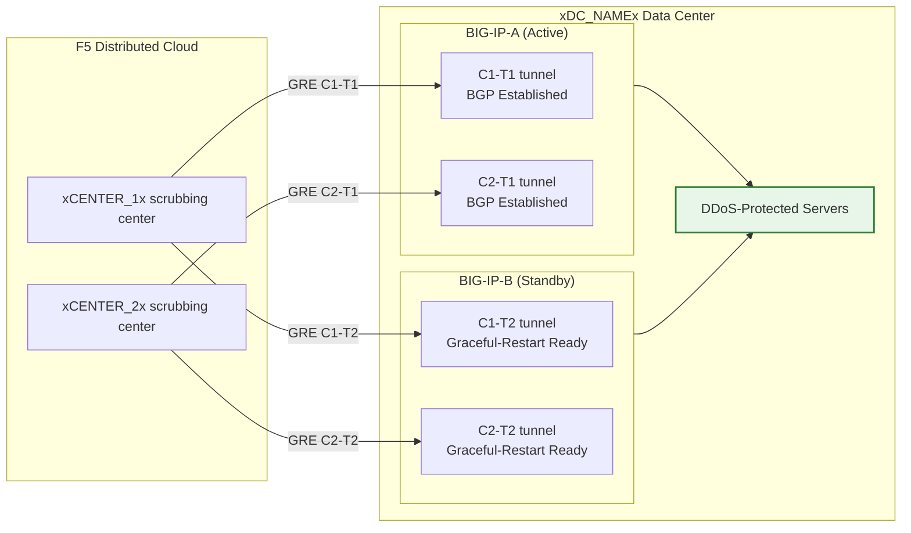

## Cloud GRE/BGP BIG-IP

- Configure **túneis GRE** e **peering BGP** a partir de um par BIG-IP HA
  (atuando como equipamento nas instalações do cliente, CPE), com túneis
  independentes por unidade.
- Conecte-se aos centros de limpeza de **Mitigação Cloud DDoS** em **modo roteado** (L3/L4).

## Requisitos

- Serviço de **Mitigação DDoS Roteada L3/L4** Cloud
  (Always On ou Always Available) habilitado para o seu tenant.
- BIG-IP com:
    - LTM (ou módulos de rede equivalentes).
    - **Roteamento dinâmico (BGP)** licenciado e habilitado.
- Modo roteado: pelo menos um prefixo **publicamente anunciado /24 (ou mais curto)**
  para proteção (mínimo IPv6 é **/48**).
    - Prefixos protegidos **devem ser publicamente roteáveis** (não RFC 1918).
     Os endpoints externos GRE também devem ser publicamente roteáveis quando os túneis
     atravessam a Internet pública; implantações que utilizam conectividade
     privada (L2, peering privado) podem usar endereços de endpoint
     RFC 1918.
- Conectividade entre o seu data center/roteador e o(s)
  centro(s) de limpeza Cloud.

## Arquitetura HA

O BIG-IP é implantado como um **par HA ativo/standby**, cada unidade
possui seus próprios túneis GRE independentes e sessões BGP para cada
centro de limpeza:

- **Endpoints de túnel independentes**: Cada unidade BIG-IP possui seu próprio
  self IP externo não flutuante (`traffic-group-local-only`) e seu
  próprio conjunto de túneis GRE. O BIG-IP-A usa `xBIGIP_A_OUTER_V4x` e
  o BIG-IP-B usa `xBIGIP_B_OUTER_V4x` como endpoints de túnel. Isso evita
  dependência de um IP flutuante para a origem do túnel.
- **Sessões BGP independentes**: Cada unidade executa suas próprias sessões BGP
  sobre seus próprios túneis. O BIG-IP-A faz peering com C1-T1 e C2-T1;
  o BIG-IP-B faz peering com C1-T2 e C2-T2. No failover, as sessões BGP
  da unidade standby já estão estabelecidas, então o
  Cloud pode redirecionar o tráfego imediatamente.
- **Sincronização de configuração**: As configurações de túnel, self IP e roteamento são
  sincronizadas entre as unidades via **config-sync**. Como a configuração BGP
  do `imish` é por unidade, cada unidade mantém suas próprias
  declarações de neighbor. Verifique se a sincronização inclui todos os objetos tmsh.
- **Comportamento BGP ativo/standby**: A unidade ativa anuncia
  prefixos protegidos com atributos BGP normais. A unidade standby
  pode anunciar os mesmos prefixos com um AS-path prepend mais longo
  (tornando-a menos preferida) ou suprimir os anúncios
  até o failover. Coordene a abordagem com o SOC.
- **Convergência de failover**: Com `graceful-restart` habilitado e
  túneis independentes, a nova unidade ativa já possui sessões BGP
  estabelecidas. A convergência depende da seleção de best-path BGP
  mudando para os anúncios da unidade recém-ativa. Teste com
  `run sys failover standby`.

:::note
O modelo HA de túneis independentes acima é a abordagem recomendada
para redundância de dispositivos no lado do cliente. Valide o seu design
específico de failover com a sua equipe de conta antes de ir para
produção, particularmente em relação à estratégia de AS-path prepend e
ao tempo de reconvergência BGP.
:::
