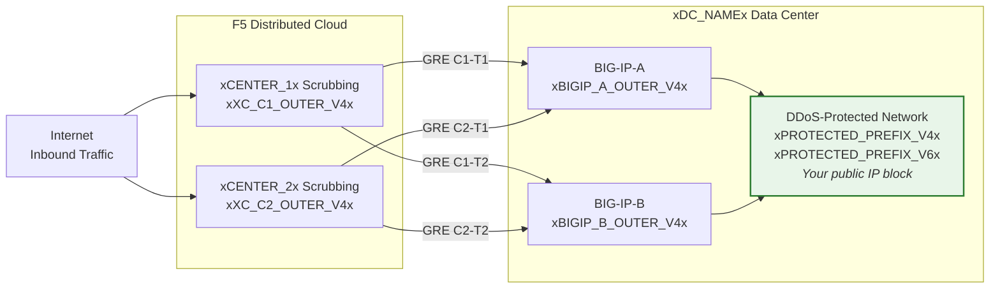
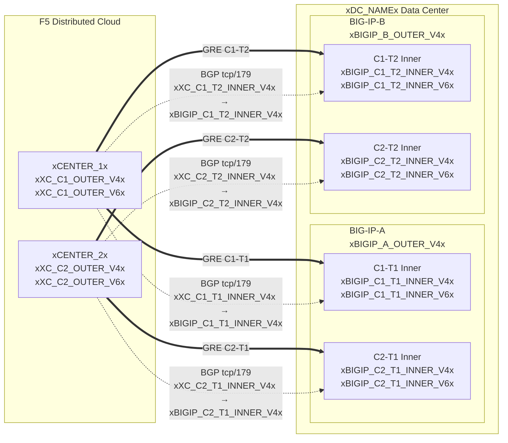

## Topologia e endereços

Configuração para o data center **xDC_NAMEx**
conectando-se a centros de limpeza em nuvem.

:::note
**Estes são valores de exemplo.** Substitua pelos valores específicos do cliente e
fornecidos pelo SOC usando as tabelas acima.

Os prefixos protegidos **devem ser publicamente roteáveis** (não-RFC 1918).
Os IPs externos do GRE também devem ser publicamente roteáveis quando os túneis
atravessam a Internet pública; conectividade privada (L2, peering privado)
pode permitir endpoints RFC 1918. Consulte
[K000147949](https://my.f5.com/manage/s/article/K000147949) para exemplos usando endereços de documentação adequados.

Para redundância, crie **2 túneis por unidade BIG-IP** para centros de limpeza
localizados geograficamente diferentes (4 túneis no total para um par HA).
:::

## Planilhas

Use as seguintes planilhas de XC e BIG-IP como referência ao construir a configuração do túnel.

### XC

**Túnel C1-T1 — Centro 1 para BIG-IP-A:**

- IPs externos do GRE (para endpoints do túnel):
    - IPv4 SRC: `xXC_C1_OUTER_V4x/24`
    - IPv4 DST: `xBIGIP_A_OUTER_V4x/24`
    - IPv6 SRC: `xXC_C1_OUTER_V6x/64`
    - IPv6 DST: `xBIGIP_A_OUTER_V6x/64`

- IPs internos do GRE (para sessão BGP):
    - IPv4: `xXC_C1_T1_INNER_V4x/30`
    - IPv6: `xXC_C1_T1_INNER_V6x/64`

**Túnel C1-T2 — Centro 1 para BIG-IP-B:**

- IPs externos do GRE (para endpoints do túnel):
    - IPv4 SRC: `xXC_C1_OUTER_V4x/24`
    - IPv4 DST: `xBIGIP_B_OUTER_V4x/24`
    - IPv6 SRC: `xXC_C1_OUTER_V6x/64`
    - IPv6 DST: `xBIGIP_B_OUTER_V6x/64`

- IPs internos do GRE (para sessão BGP):
    - IPv4: `xXC_C1_T2_INNER_V4x/30`
    - IPv6: `xXC_C1_T2_INNER_V6x/64`

**Túnel C2-T1 — Centro 2 para BIG-IP-A:**

- IPs externos do GRE (para endpoints do túnel):
    - IPv4 SRC: `xXC_C2_OUTER_V4x/24`
    - IPv4 DST: `xBIGIP_A_OUTER_V4x/24`
    - IPv6 SRC: `xXC_C2_OUTER_V6x/64`
    - IPv6 DST: `xBIGIP_A_OUTER_V6x/64`

- IPs internos do GRE (para sessão BGP):
    - IPv4: `xXC_C2_T1_INNER_V4x/30`
    - IPv6: `xXC_C2_T1_INNER_V6x/64`

**Túnel C2-T2 — Centro 2 para BIG-IP-B:**

- IPs externos do GRE (para endpoints do túnel):
    - IPv4 SRC: `xXC_C2_OUTER_V4x/24`
    - IPv4 DST: `xBIGIP_B_OUTER_V4x/24`
    - IPv6 SRC: `xXC_C2_OUTER_V6x/64`
    - IPv6 DST: `xBIGIP_B_OUTER_V6x/64`

- IPs internos do GRE (para sessão BGP):
    - IPv4: `xXC_C2_T2_INNER_V4x/30`
    - IPv6: `xXC_C2_T2_INNER_V6x/64`

:::note[IPs internos (trânsito)]
IPs internos como `10.10.10.0/30` utilizam endereços RFC 1918. Isso é
correto porque eles são encapsulados dentro do túnel GRE e nunca
aparecem na Internet pública. Os prefixos protegidos devem sempre ser
publicamente roteáveis; os IPs externos dos endpoints devem ser publicamente roteáveis quando
os túneis atravessam a Internet pública.
:::

:::note[Links internos IPv6]
Os links internos IPv6 utilizam prefixos /64 aqui para corresponder aos
padrões comuns da nuvem. Para links ponto a ponto, /127 é preferível conforme
[RFC 6164](https://datatracker.ietf.org/doc/html/rfc6164) para evitar exaustão de neighbor-discovery. Utilize /127
se a atribuição de túnel pelo SOC suportar isso.
:::

### BIG-IP

**BIG-IP-A** (IP externo `xBIGIP_A_OUTER_V4x` / `xBIGIP_A_OUTER_V6x`):

- IPs externos do GRE:
    - IPv4 SRC: `xBIGIP_A_OUTER_V4x/24`
    - IPv4 DST (Centro 1): `xXC_C1_OUTER_V4x/24`
    - IPv4 DST (Centro 2): `xXC_C2_OUTER_V4x/24`
    - IPv6 SRC: `xBIGIP_A_OUTER_V6x/64`
    - IPv6 DST (Centro 1): `xXC_C1_OUTER_V6x/64`
    - IPv6 DST (Centro 2): `xXC_C2_OUTER_V6x/64`

- IPs internos do GRE — Túnel C1-T1:
    - IPv4: `xBIGIP_C1_T1_INNER_V4x/30`
    - IPv6: `xBIGIP_C1_T1_INNER_V6x/64`

- IPs internos do GRE — Túnel C2-T1:
    - IPv4: `xBIGIP_C2_T1_INNER_V4x/30`
    - IPv6: `xBIGIP_C2_T1_INNER_V6x/64`

**BIG-IP-B** (IP externo `xBIGIP_B_OUTER_V4x` / `xBIGIP_B_OUTER_V6x`):

- IPs externos do GRE:
    - IPv4 SRC: `xBIGIP_B_OUTER_V4x/24`
    - IPv4 DST (Centro 1): `xXC_C1_OUTER_V4x/24`
    - IPv4 DST (Centro 2): `xXC_C2_OUTER_V4x/24`
    - IPv6 SRC: `xBIGIP_B_OUTER_V6x/64`
    - IPv6 DST (Centro 1): `xXC_C1_OUTER_V6x/64`
    - IPv6 DST (Centro 2): `xXC_C2_OUTER_V6x/64`

- IPs internos do GRE — Túnel C1-T2:
    - IPv4: `xBIGIP_C1_T2_INNER_V4x/30`
    - IPv6: `xBIGIP_C1_T2_INNER_V6x/64`

- IPs internos do GRE — Túnel C2-T2:
    - IPv4: `xBIGIP_C2_T2_INNER_V4x/30`
    - IPv6: `xBIGIP_C2_T2_INNER_V6x/64`

- Prefixos protegidos (anunciados para a nuvem):
    - IPv4: `xPROTECTED_NET_V4xxPROTECTED_CIDR_V4x`
    - IPv6: `xPROTECTED_PREFIX_V6x`

### Diagrama detalhado de topologia

