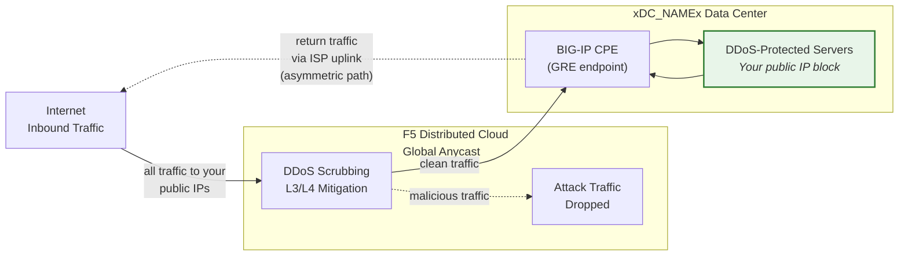
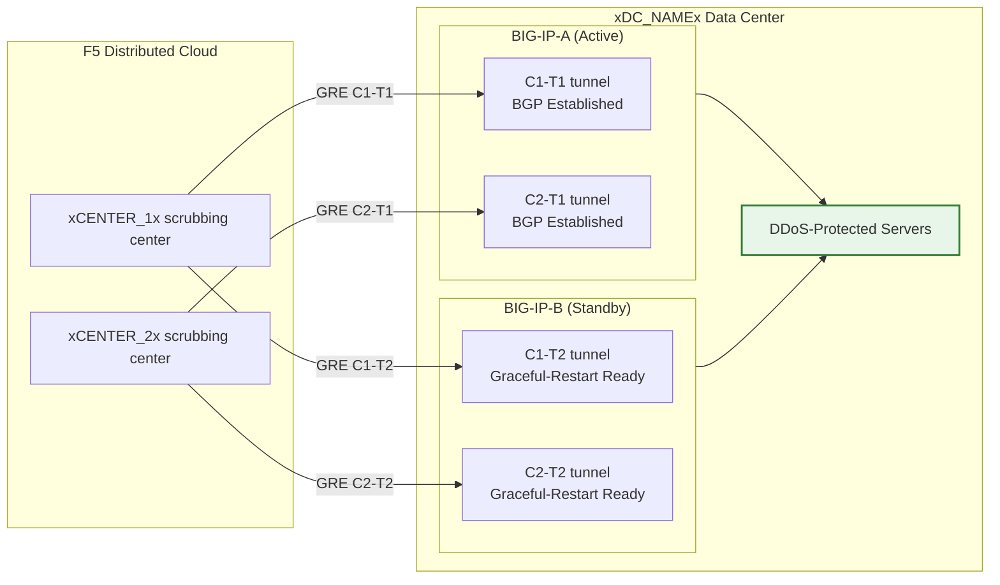

## Cloud GRE/BGP BIG-IP

- กำหนดค่า **อุโมงค์ GRE** และ **การเชื่อมต่อ BGP** จากคู่ BIG-IP HA
  (ทำหน้าที่เป็นอุปกรณ์ประจำสถานที่ของลูกค้า หรือ CPE) โดยมี
  อุโมงค์อิสระต่อหนึ่งหน่วย
- เชื่อมต่อกับศูนย์ขัดกรองของ **Cloud DDoS Mitigation**
  ในโหมด **routed** (L3/L4)

## ข้อกำหนด

- บริการ **Cloud L3/L4 Routed DDoS Mitigation**
  (Always On หรือ Always Available) ที่เปิดใช้งานสำหรับ tenant ของคุณ
- BIG-IP ที่มี:
    - LTM (หรือโมดูลเครือข่ายที่เทียบเท่า)
    - **Dynamic routing (BGP)** ที่ได้รับใบอนุญาตและเปิดใช้งานแล้ว
- โหมด routed: มีคำนำหน้า **publicly advertised /24 (หรือสั้นกว่า)**
  อย่างน้อยหนึ่งรายการสำหรับการป้องกัน (IPv6 ขั้นต่ำคือ **/48**)
    - คำนำหน้าที่ได้รับการป้องกัน **ต้องเป็นแบบ publicly routable** (ไม่ใช่ RFC 1918)
     ปลายทาง GRE ด้านนอกต้องเป็น publicly routable เช่นกัน เมื่ออุโมงค์
     เชื่อมผ่านอินเทอร์เน็ตสาธารณะ การใช้งานที่ใช้การเชื่อมต่อแบบส่วนตัว
     (L2, private peering) อาจใช้ที่อยู่ปลายทาง RFC 1918 ได้
- การเชื่อมต่อระหว่างดาต้าเซ็นเตอร์/เราเตอร์ของคุณกับ
  ศูนย์ขัดกรอง Cloud

## สถาปัตยกรรม HA

BIG-IP ถูกติดตั้งในรูปแบบ **คู่ HA active/standby** โดยแต่ละหน่วย
จะมีอุโมงค์ GRE และเซสชัน BGP อิสระของตัวเองไปยังทุกศูนย์ขัดกรอง:

- **ปลายทางอุโมงค์อิสระ**: แต่ละหน่วย BIG-IP มี outer self IP
  แบบไม่ลอย (`traffic-group-local-only`) และชุดอุโมงค์ GRE ของตัวเอง
  BIG-IP-A ใช้ `xBIGIP_A_OUTER_V4x` และ BIG-IP-B ใช้ `xBIGIP_B_OUTER_V4x`
  เป็นปลายทางอุโมงค์ ซึ่งหลีกเลี่ยงการพึ่งพา floating IP สำหรับการ
  กำหนดต้นทางของอุโมงค์
- **เซสชัน BGP อิสระ**: แต่ละหน่วยรันเซสชัน BGP ของตัวเองผ่านอุโมงค์
  ของตัวเอง BIG-IP-A เชื่อมต่อกับ C1-T1 และ C2-T1 ส่วน BIG-IP-B
  เชื่อมต่อกับ C1-T2 และ C2-T2 เมื่อเกิดการ failover เซสชัน BGP
  ของหน่วย standby ได้รับการสร้างไว้แล้ว ทำให้ Cloud สามารถ
  เปลี่ยนเส้นทางทราฟฟิกได้ทันที
- **Config sync**: การกำหนดค่าอุโมงค์ self IP และการกำหนดเส้นทาง
  จะถูกซิงค์ระหว่างหน่วยผ่าน **config-sync** เนื่องจากการกำหนดค่า BGP
  ของ `imish` นั้นเป็นแบบต่อหน่วย แต่ละหน่วยจึงดูแล neighbor statements
  ของตัวเอง ตรวจสอบว่าการซิงค์ครอบคลุมออบเจกต์ tmsh ทั้งหมด
- **พฤติกรรม BGP แบบ Active/standby**: หน่วย active จะโฆษณา
  คำนำหน้าที่ได้รับการป้องกันด้วยแอตทริบิวต์ BGP ปกติ หน่วย standby
  สามารถโฆษณาคำนำหน้าเดียวกันด้วย AS-path prepend ที่ยาวกว่า
  (ทำให้มีความสำคัญน้อยกว่า) หรือระงับการโฆษณาจนกว่าจะเกิด failover
  ประสานแนวทางนี้กับ SOC
- **การบรรจบตัวของ Failover**: เมื่อเปิดใช้งาน `graceful-restart`
  และมีอุโมงค์อิสระ หน่วย active ใหม่จะมีเซสชัน BGP ที่สร้างไว้แล้ว
  การบรรจบตัวขึ้นอยู่กับการเลือก BGP best-path ที่เปลี่ยนไปยัง
  การโฆษณาของหน่วย active ใหม่ ทดสอบด้วย `run sys failover standby`

:::note
โมเดล HA แบบอุโมงค์อิสระที่กล่าวมาข้างต้นเป็นแนวทางที่แนะนำ
สำหรับความซ้ำซ้อนของอุปกรณ์ฝั่งลูกค้า ตรวจสอบการออกแบบ failover
เฉพาะของคุณกับทีมบัญชีก่อนนำไปใช้งานจริง โดยเฉพาะอย่างยิ่ง
เกี่ยวกับกลยุทธ์ AS-path prepend และระยะเวลาการบรรจบตัวของ BGP ใหม่
:::
