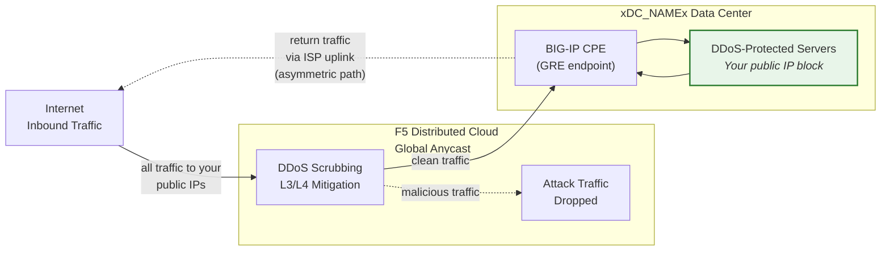
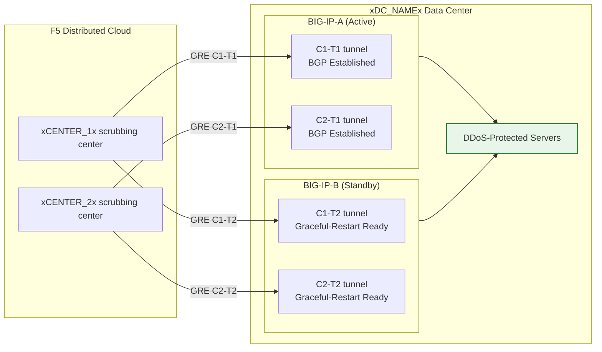

## Cloud GRE/BGP BIG-IP

- กำหนดค่า **GRE tunnels** และ **BGP peering** จาก BIG-IP HA pair
  (ทำหน้าที่เป็นอุปกรณ์ฝั่งลูกค้า, CPE) โดยมี tunnel อิสระ
  ต่อแต่ละยูนิต
- เชื่อมต่อกับศูนย์กรองข้อมูล **Cloud DDoS Mitigation** ใน **routed mode** (L3/L4)

## ข้อกำหนดเบื้องต้น

- บริการ Cloud **L3/L4 Routed DDoS Mitigation**
  (Always On หรือ Always Available) เปิดใช้งานสำหรับ tenant ของคุณ
- BIG-IP ที่มี:
    - LTM (หรือ networking modules ที่เทียบเท่า)
    - **Dynamic routing (BGP)** ที่ได้รับ license และเปิดใช้งานแล้ว
- Routed mode: อย่างน้อยหนึ่ง prefix **ที่ประกาศสาธารณะขนาด /24 (หรือสั้นกว่า)**
  สำหรับการป้องกัน (IPv6 ขั้นต่ำคือ **/48**)
    - prefix ที่ได้รับการป้องกัน **ต้องสามารถ route ได้สาธารณะ** (ไม่ใช่ RFC 1918)
     GRE outer endpoints ต้องสามารถ route ได้สาธารณะเช่นกันเมื่อ tunnel
     ผ่าน Internet สาธารณะ; การติดตั้งที่ใช้การเชื่อมต่อส่วนตัว
     (L2, private peering) สามารถใช้ที่อยู่ endpoint แบบ RFC 1918 ได้
- การเชื่อมต่อระหว่าง data center/router ของคุณกับ
  ศูนย์กรองข้อมูล Cloud

## สถาปัตยกรรม HA

BIG-IP ถูกติดตั้งเป็น **active/standby HA pair** โดยแต่ละยูนิต
จะมี GRE tunnel และ BGP session อิสระของตัวเองไปยังทุก
ศูนย์กรองข้อมูล:

- **Tunnel endpoint อิสระ**: แต่ละยูนิต BIG-IP มี outer self IP
  ที่ไม่ใช่ floating ของตัวเอง (`traffic-group-local-only`) และมีชุด
  GRE tunnel ของตัวเอง BIG-IP-A ใช้ `xBIGIP_A_OUTER_V4x` และ
  BIG-IP-B ใช้ `xBIGIP_B_OUTER_V4x` เป็น tunnel endpoint สิ่งนี้หลีกเลี่ยง
  การพึ่งพา floating IP สำหรับการสร้าง tunnel
- **BGP session อิสระ**: แต่ละยูนิตรัน BGP session ของตัวเอง
  ผ่าน tunnel ของตัวเอง BIG-IP-A peer กับ C1-T1 และ C2-T1;
  BIG-IP-B peer กับ C1-T2 และ C2-T2 เมื่อเกิด failover BGP session
  ของยูนิต standby ถูกสร้างขึ้นแล้ว ดังนั้น
  Cloud สามารถเปลี่ยนเส้นทาง traffic ได้ทันที
- **Config sync**: การกำหนดค่า tunnel, self IP และ routing จะถูก
  sync ระหว่างยูนิตผ่าน **config-sync** เนื่องจากการกำหนดค่า BGP ของ `imish`
  เป็นแบบต่อยูนิต แต่ละยูนิตจะจัดการ neighbor statement
  ของตัวเอง ตรวจสอบว่า sync รวม tmsh object ทั้งหมด
- **พฤติกรรม BGP แบบ active/standby**: ยูนิต active ประกาศ
  prefix ที่ได้รับการป้องกันด้วย BGP attribute ปกติ ยูนิต standby
  สามารถประกาศ prefix เดียวกันด้วย AS-path prepend ที่ยาวกว่า
  (ทำให้ถูกเลือกน้อยกว่า) หรือระงับการประกาศ
  จนกว่าจะเกิด failover ประสานแนวทางกับ SOC
- **Failover convergence**: เมื่อเปิดใช้งาน `graceful-restart` และ
  tunnel อิสระ ยูนิต active ใหม่จะมี BGP session
  ที่สร้างขึ้นแล้ว Convergence ขึ้นอยู่กับการเลือก BGP best-path
  ที่เปลี่ยนไปยังการประกาศของยูนิต active ใหม่ ทดสอบด้วย
  `run sys failover standby`

:::note
โมเดล HA แบบ tunnel อิสระด้านบนเป็นแนวทางที่แนะนำ
สำหรับการทำ redundancy ของอุปกรณ์ฝั่งลูกค้า ตรวจสอบความถูกต้องของ
การออกแบบ failover เฉพาะของคุณกับทีมบัญชีของคุณก่อนนำไปใช้งาน
จริง โดยเฉพาะเกี่ยวกับกลยุทธ์ AS-path prepend และระยะเวลา
BGP reconvergence
:::
