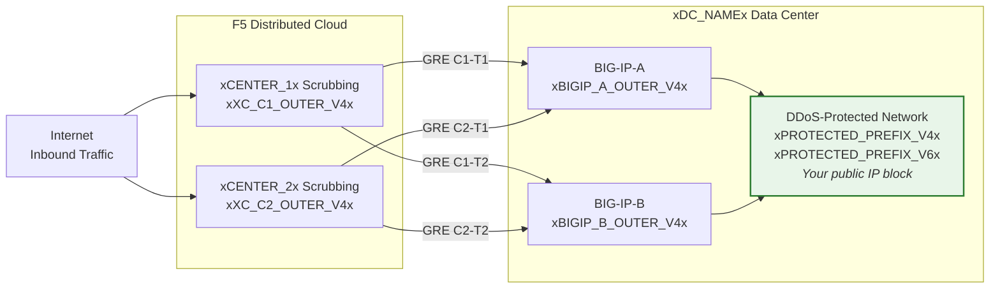
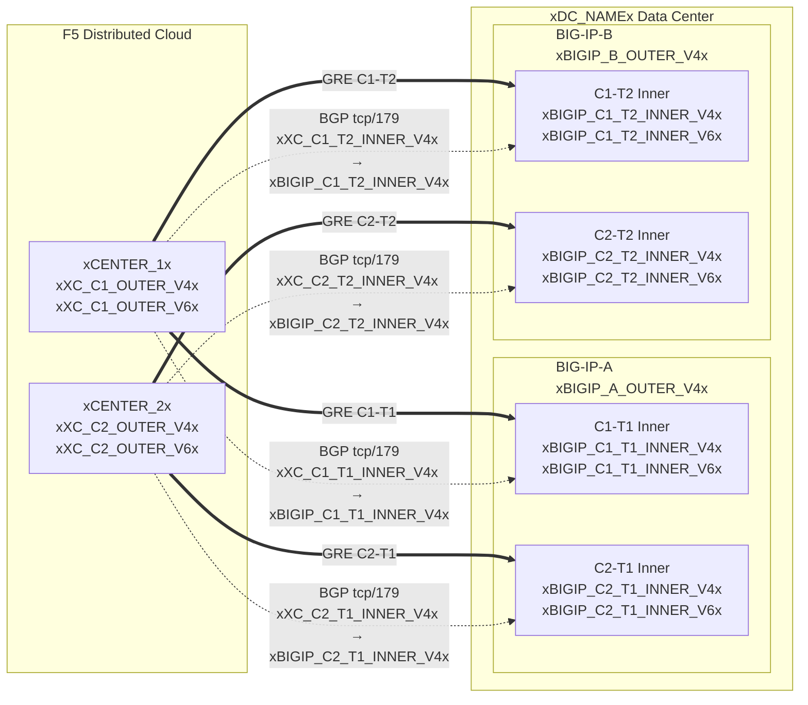

## โทโพโลยีและที่อยู่

การกำหนดค่าสำหรับศูนย์ข้อมูล **xDC_NAMEx**
ที่เชื่อมต่อกับศูนย์กรองทราฟฟิก (scrubbing centers) บนคลาวด์

:::note
**ค่าเหล่านี้เป็นตัวอย่างเท่านั้น** ให้แทนที่ด้วยค่าเฉพาะของลูกค้าและ
ค่าที่ SOC ให้มาโดยใช้ตารางด้านบน

พรีฟิกซ์ที่ต้องการป้องกัน **ต้องสามารถเราต์ได้แบบสาธารณะ** (ไม่ใช่ RFC 1918)
IP ปลายทาง GRE ภายนอกต้องสามารถเราต์ได้แบบสาธารณะเช่นกันเมื่อ tunnel
ผ่านอินเทอร์เน็ตสาธารณะ; การเชื่อมต่อแบบส่วนตัว (L2, private
peering) อาจอนุญาตให้ใช้ endpoint ที่เป็น RFC 1918 ได้ ดู
[K000147949](https://my.f5.com/manage/s/article/K000147949) สำหรับตัวอย่างการใช้ที่อยู่สำหรับเอกสารที่ถูกต้อง

เพื่อความสำรอง ให้สร้าง **tunnel 2 อันต่อ BIG-IP แต่ละยูนิต** ไปยัง
ศูนย์กรองทราฟฟิกที่อยู่คนละพื้นที่ทางภูมิศาสตร์ (รวม 4 tunnel สำหรับคู่ HA)
:::

## เวิร์กชีต

ใช้เวิร์กชีต XC และ BIG-IP ต่อไปนี้เป็นข้อมูลอ้างอิงเมื่อสร้างการกำหนดค่า tunnel

### XC

**Tunnel C1-T1 — Center 1 ไปยัง BIG-IP-A:**

- IP ภายนอก GRE (สำหรับ endpoint ของ tunnel):
    - IPv4 SRC: `xXC_C1_OUTER_V4x/24`
    - IPv4 DST: `xBIGIP_A_OUTER_V4x/24`
    - IPv6 SRC: `xXC_C1_OUTER_V6x/64`
    - IPv6 DST: `xBIGIP_A_OUTER_V6x/64`

- IP ภายใน GRE (สำหรับเซสชัน BGP):
    - IPv4: `xXC_C1_T1_INNER_V4x/30`
    - IPv6: `xXC_C1_T1_INNER_V6x/64`

**Tunnel C1-T2 — Center 1 ไปยัง BIG-IP-B:**

- IP ภายนอก GRE (สำหรับ endpoint ของ tunnel):
    - IPv4 SRC: `xXC_C1_OUTER_V4x/24`
    - IPv4 DST: `xBIGIP_B_OUTER_V4x/24`
    - IPv6 SRC: `xXC_C1_OUTER_V6x/64`
    - IPv6 DST: `xBIGIP_B_OUTER_V6x/64`

- IP ภายใน GRE (สำหรับเซสชัน BGP):
    - IPv4: `xXC_C1_T2_INNER_V4x/30`
    - IPv6: `xXC_C1_T2_INNER_V6x/64`

**Tunnel C2-T1 — Center 2 ไปยัง BIG-IP-A:**

- IP ภายนอก GRE (สำหรับ endpoint ของ tunnel):
    - IPv4 SRC: `xXC_C2_OUTER_V4x/24`
    - IPv4 DST: `xBIGIP_A_OUTER_V4x/24`
    - IPv6 SRC: `xXC_C2_OUTER_V6x/64`
    - IPv6 DST: `xBIGIP_A_OUTER_V6x/64`

- IP ภายใน GRE (สำหรับเซสชัน BGP):
    - IPv4: `xXC_C2_T1_INNER_V4x/30`
    - IPv6: `xXC_C2_T1_INNER_V6x/64`

**Tunnel C2-T2 — Center 2 ไปยัง BIG-IP-B:**

- IP ภายนอก GRE (สำหรับ endpoint ของ tunnel):
    - IPv4 SRC: `xXC_C2_OUTER_V4x/24`
    - IPv4 DST: `xBIGIP_B_OUTER_V4x/24`
    - IPv6 SRC: `xXC_C2_OUTER_V6x/64`
    - IPv6 DST: `xBIGIP_B_OUTER_V6x/64`

- IP ภายใน GRE (สำหรับเซสชัน BGP):
    - IPv4: `xXC_C2_T2_INNER_V4x/30`
    - IPv6: `xXC_C2_T2_INNER_V6x/64`

:::note[IP ภายใน (transit)]
IP ภายในเช่น `10.10.10.0/30` ใช้ที่อยู่ RFC 1918 ซึ่งถูกต้อง
เนื่องจากถูกห่อหุ้ม (encapsulate) อยู่ภายใน GRE tunnel และไม่ปรากฏ
บนอินเทอร์เน็ตสาธารณะ พรีฟิกซ์ที่ต้องการป้องกันต้องสามารถเราต์ได้
แบบสาธารณะเสมอ; IP endpoint ภายนอกต้องสามารถเราต์ได้แบบสาธารณะ
เมื่อ tunnel ผ่านอินเทอร์เน็ตสาธารณะ
:::

:::note[ลิงก์ภายใน IPv6]
ลิงก์ภายใน IPv6 ใช้พรีฟิกซ์ /64 ที่นี่เพื่อให้ตรงกับค่าเริ่มต้น
ของคลาวด์ทั่วไป สำหรับลิงก์แบบ point-to-point แนะนำให้ใช้ /127 ตาม
[RFC 6164](https://datatracker.ietf.org/doc/html/rfc6164) เพื่อหลีกเลี่ยง neighbor-discovery exhaustion ให้ใช้ /127
หากการกำหนด tunnel ของ SOC รองรับ
:::

### BIG-IP

**BIG-IP-A** (IP ภายนอก `xBIGIP_A_OUTER_V4x` / `xBIGIP_A_OUTER_V6x`):

- IP ภายนอก GRE:
    - IPv4 SRC: `xBIGIP_A_OUTER_V4x/24`
    - IPv4 DST (Center 1): `xXC_C1_OUTER_V4x/24`
    - IPv4 DST (Center 2): `xXC_C2_OUTER_V4x/24`
    - IPv6 SRC: `xBIGIP_A_OUTER_V6x/64`
    - IPv6 DST (Center 1): `xXC_C1_OUTER_V6x/64`
    - IPv6 DST (Center 2): `xXC_C2_OUTER_V6x/64`

- IP ภายใน GRE — Tunnel C1-T1:
    - IPv4: `xBIGIP_C1_T1_INNER_V4x/30`
    - IPv6: `xBIGIP_C1_T1_INNER_V6x/64`

- IP ภายใน GRE — Tunnel C2-T1:
    - IPv4: `xBIGIP_C2_T1_INNER_V4x/30`
    - IPv6: `xBIGIP_C2_T1_INNER_V6x/64`

**BIG-IP-B** (IP ภายนอก `xBIGIP_B_OUTER_V4x` / `xBIGIP_B_OUTER_V6x`):

- IP ภายนอก GRE:
    - IPv4 SRC: `xBIGIP_B_OUTER_V4x/24`
    - IPv4 DST (Center 1): `xXC_C1_OUTER_V4x/24`
    - IPv4 DST (Center 2): `xXC_C2_OUTER_V4x/24`
    - IPv6 SRC: `xBIGIP_B_OUTER_V6x/64`
    - IPv6 DST (Center 1): `xXC_C1_OUTER_V6x/64`
    - IPv6 DST (Center 2): `xXC_C2_OUTER_V6x/64`

- IP ภายใน GRE — Tunnel C1-T2:
    - IPv4: `xBIGIP_C1_T2_INNER_V4x/30`
    - IPv6: `xBIGIP_C1_T2_INNER_V6x/64`

- IP ภายใน GRE — Tunnel C2-T2:
    - IPv4: `xBIGIP_C2_T2_INNER_V4x/30`
    - IPv6: `xBIGIP_C2_T2_INNER_V6x/64`

- พรีฟิกซ์ที่ต้องการป้องกัน (ประกาศไปยังคลาวด์):
    - IPv4: `xPROTECTED_NET_V4xxPROTECTED_CIDR_V4x`
    - IPv6: `xPROTECTED_PREFIX_V6x`

### ไดอะแกรมโทโพโลยีแบบละเอียด

