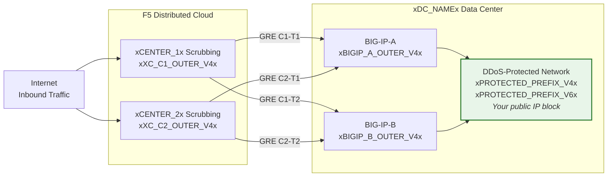
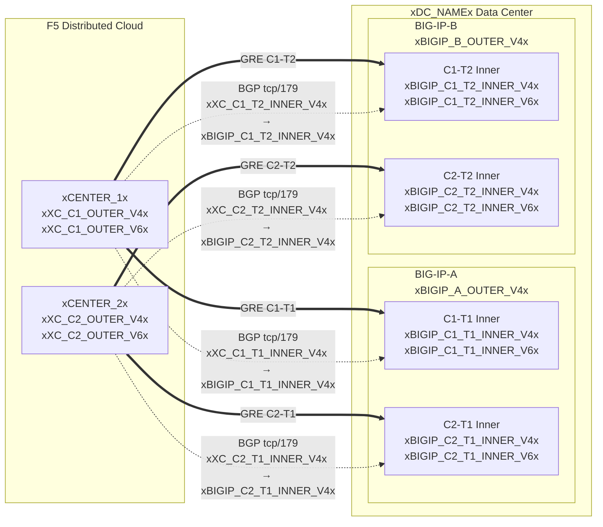

## โทโพโลยีและที่อยู่

การกำหนดค่าสำหรับศูนย์ข้อมูล **xDC_NAMEx**
ที่เชื่อมต่อกับศูนย์ทำความสะอาดบนคลาวด์

:::note
**นี่คือค่าตัวอย่าง** โปรดแทนที่ด้วยค่าเฉพาะของลูกค้าและ
ค่าที่ SOC จัดเตรียมโดยใช้ตารางด้านบน

คำนำหน้าที่ได้รับการป้องกัน **ต้องสามารถกำหนดเส้นทางได้แบบสาธารณะ** (ไม่ใช่ RFC 1918)
IP ปลายทางด้านนอกของ GRE ต้องสามารถกำหนดเส้นทางได้แบบสาธารณะเช่นกันเมื่ออุโมงค์
ผ่านอินเทอร์เน็ตสาธารณะ การเชื่อมต่อแบบส่วนตัว (L2, private
peering) อาจอนุญาตให้ใช้ปลายทาง RFC 1918 ได้ ดู
[K000147949](https://my.f5.com/manage/s/article/K000147949) สำหรับตัวอย่างการใช้ที่อยู่ในเอกสารที่ถูกต้อง

สำหรับความซ้ำซ้อน ให้สร้าง **2 อุโมงค์ต่อหน่วย BIG-IP** ไปยังศูนย์ทำความสะอาดที่ตั้งอยู่ในพื้นที่ภูมิศาสตร์ต่างกัน (รวม 4 อุโมงค์สำหรับคู่ HA)
:::

## แผ่นงาน

ใช้แผ่นงาน XC และ BIG-IP ต่อไปนี้เป็นข้อมูลอ้างอิงเมื่อสร้างการกำหนดค่าอุโมงค์

### XC

**อุโมงค์ C1-T1 — ศูนย์ 1 ถึง BIG-IP-A:**

- IP ด้านนอกของ GRE (สำหรับปลายทางอุโมงค์):
    - IPv4 SRC: `xXC_C1_OUTER_V4x/24`
    - IPv4 DST: `xBIGIP_A_OUTER_V4x/24`
    - IPv6 SRC: `xXC_C1_OUTER_V6x/64`
    - IPv6 DST: `xBIGIP_A_OUTER_V6x/64`

- IP ด้านในของ GRE (สำหรับเซสชัน BGP):
    - IPv4: `xXC_C1_T1_INNER_V4x/30`
    - IPv6: `xXC_C1_T1_INNER_V6x/64`

**อุโมงค์ C1-T2 — ศูนย์ 1 ถึง BIG-IP-B:**

- IP ด้านนอกของ GRE (สำหรับปลายทางอุโมงค์):
    - IPv4 SRC: `xXC_C1_OUTER_V4x/24`
    - IPv4 DST: `xBIGIP_B_OUTER_V4x/24`
    - IPv6 SRC: `xXC_C1_OUTER_V6x/64`
    - IPv6 DST: `xBIGIP_B_OUTER_V6x/64`

- IP ด้านในของ GRE (สำหรับเซสชัน BGP):
    - IPv4: `xXC_C1_T2_INNER_V4x/30`
    - IPv6: `xXC_C1_T2_INNER_V6x/64`

**อุโมงค์ C2-T1 — ศูนย์ 2 ถึง BIG-IP-A:**

- IP ด้านนอกของ GRE (สำหรับปลายทางอุโมงค์):
    - IPv4 SRC: `xXC_C2_OUTER_V4x/24`
    - IPv4 DST: `xBIGIP_A_OUTER_V4x/24`
    - IPv6 SRC: `xXC_C2_OUTER_V6x/64`
    - IPv6 DST: `xBIGIP_A_OUTER_V6x/64`

- IP ด้านในของ GRE (สำหรับเซสชัน BGP):
    - IPv4: `xXC_C2_T1_INNER_V4x/30`
    - IPv6: `xXC_C2_T1_INNER_V6x/64`

**อุโมงค์ C2-T2 — ศูนย์ 2 ถึง BIG-IP-B:**

- IP ด้านนอกของ GRE (สำหรับปลายทางอุโมงค์):
    - IPv4 SRC: `xXC_C2_OUTER_V4x/24`
    - IPv4 DST: `xBIGIP_B_OUTER_V4x/24`
    - IPv6 SRC: `xXC_C2_OUTER_V6x/64`
    - IPv6 DST: `xBIGIP_B_OUTER_V6x/64`

- IP ด้านในของ GRE (สำหรับเซสชัน BGP):
    - IPv4: `xXC_C2_T2_INNER_V4x/30`
    - IPv6: `xXC_C2_T2_INNER_V6x/64`

:::note[IP ด้านใน (transit)]
IP ด้านใน เช่น `10.10.10.0/30` ใช้ที่อยู่ RFC 1918 ซึ่งถือว่า
ถูกต้องเนื่องจากถูกห่อหุ้มอยู่ภายในอุโมงค์ GRE และไม่ปรากฏบน
อินเทอร์เน็ตสาธารณะ คำนำหน้าที่ได้รับการป้องกันต้องสามารถกำหนดเส้นทางได้แบบสาธารณะเสมอ
IP ปลายทางด้านนอกต้องสามารถกำหนดเส้นทางได้แบบสาธารณะเมื่ออุโมงค์ผ่านอินเทอร์เน็ตสาธารณะ
:::

:::note[ลิงก์ด้านในของ IPv6]
ลิงก์ด้านในของ IPv6 ใช้คำนำหน้า /64 ที่นี่เพื่อให้ตรงกับค่าเริ่มต้น
ทั่วไปของคลาวด์ สำหรับลิงก์แบบ point-to-point นิยมใช้ /127 ตาม
[RFC 6164](https://datatracker.ietf.org/doc/html/rfc6164) เพื่อหลีกเลี่ยงการหมดสิ้นของ neighbor-discovery ให้ใช้ /127
หากการกำหนดอุโมงค์ของ SOC รองรับ
:::

### BIG-IP

**BIG-IP-A** (IP ด้านนอก `xBIGIP_A_OUTER_V4x` / `xBIGIP_A_OUTER_V6x`):

- IP ด้านนอกของ GRE:
    - IPv4 SRC: `xBIGIP_A_OUTER_V4x/24`
    - IPv4 DST (ศูนย์ 1): `xXC_C1_OUTER_V4x/24`
    - IPv4 DST (ศูนย์ 2): `xXC_C2_OUTER_V4x/24`
    - IPv6 SRC: `xBIGIP_A_OUTER_V6x/64`
    - IPv6 DST (ศูนย์ 1): `xXC_C1_OUTER_V6x/64`
    - IPv6 DST (ศูนย์ 2): `xXC_C2_OUTER_V6x/64`

- IP ด้านในของ GRE — อุโมงค์ C1-T1:
    - IPv4: `xBIGIP_C1_T1_INNER_V4x/30`
    - IPv6: `xBIGIP_C1_T1_INNER_V6x/64`

- IP ด้านในของ GRE — อุโมงค์ C2-T1:
    - IPv4: `xBIGIP_C2_T1_INNER_V4x/30`
    - IPv6: `xBIGIP_C2_T1_INNER_V6x/64`

**BIG-IP-B** (IP ด้านนอก `xBIGIP_B_OUTER_V4x` / `xBIGIP_B_OUTER_V6x`):

- IP ด้านนอกของ GRE:
    - IPv4 SRC: `xBIGIP_B_OUTER_V4x/24`
    - IPv4 DST (ศูนย์ 1): `xXC_C1_OUTER_V4x/24`
    - IPv4 DST (ศูนย์ 2): `xXC_C2_OUTER_V4x/24`
    - IPv6 SRC: `xBIGIP_B_OUTER_V6x/64`
    - IPv6 DST (ศูนย์ 1): `xXC_C1_OUTER_V6x/64`
    - IPv6 DST (ศูนย์ 2): `xXC_C2_OUTER_V6x/64`

- IP ด้านในของ GRE — อุโมงค์ C1-T2:
    - IPv4: `xBIGIP_C1_T2_INNER_V4x/30`
    - IPv6: `xBIGIP_C1_T2_INNER_V6x/64`

- IP ด้านในของ GRE — อุโมงค์ C2-T2:
    - IPv4: `xBIGIP_C2_T2_INNER_V4x/30`
    - IPv6: `xBIGIP_C2_T2_INNER_V6x/64`

- คำนำหน้าที่ได้รับการป้องกัน (โฆษณาไปยังคลาวด์):
    - IPv4: `xPROTECTED_NET_V4xxPROTECTED_CIDR_V4x`
    - IPv6: `xPROTECTED_PREFIX_V6x`

### แผนภาพโทโพโลยีแบบละเอียด

