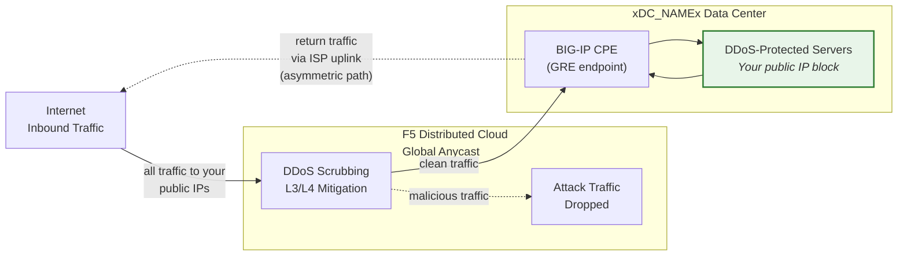
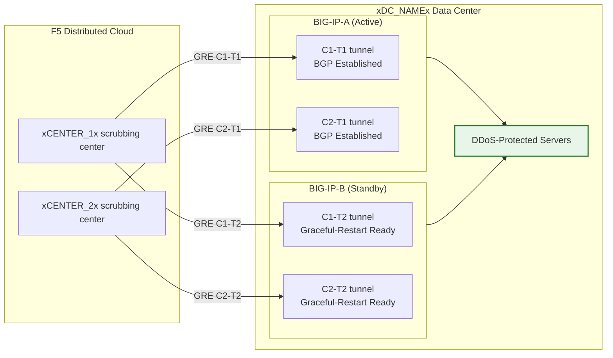

## Cloud GRE/BGP BIG-IP

- 从 BIG-IP HA 对（充当客户端设备，CPE）配置 **GRE 隧道**和 **BGP 对等连接**，每个单元具有独立的隧道。
- 以**路由模式**（L3/L4）连接到 **Cloud DDoS 缓解**清洗中心。

## 要求

- 为您的租户启用 Cloud **L3/L4 路由 DDoS 缓解**服务（Always On 或 Always Available）。
- BIG-IP 需具备：
    - LTM（或等效网络模块）。
    - **动态路由（BGP）**已授权并启用。
- 路由模式：至少需要一个**公开通告的 /24（或更短）**前缀用于防护（IPv6 最低为 **/48**）。
    - 受保护前缀**必须是可公开路由的**（非 RFC 1918）。当隧道穿越公共互联网时，GRE 外部端点也必须是可公开路由的；使用私有连接（L2、私有对等）的部署可以使用 RFC 1918 端点地址。
- 您的数据中心/路由器与 Cloud 清洗中心之间的连通性。

## HA 架构

BIG-IP 部署为**主/备 HA 对**，每个单元都拥有独立的 GRE 隧道和 BGP 会话，连接到每个清洗中心：

- **独立隧道端点**：每个 BIG-IP 单元拥有自己的非浮动外部 self IP（`traffic-group-local-only`）及其自己的 GRE 隧道集合。BIG-IP-A 使用 `xBIGIP_A_OUTER_V4x`，BIG-IP-B 使用 `xBIGIP_B_OUTER_V4x` 作为隧道端点。这避免了隧道源依赖浮动 IP。
- **独立 BGP 会话**：每个单元通过自己的隧道运行独立的 BGP 会话。BIG-IP-A 与 C1-T1 和 C2-T1 建立对等；BIG-IP-B 与 C1-T2 和 C2-T2 建立对等。在故障切换时，备用单元的 BGP 会话已经建立，因此 Cloud 可以立即转移流量。
- **配置同步**：隧道、self IP 和路由配置通过 **config-sync** 在单元之间同步。由于 `imish` BGP 配置是按单元的，每个单元维护自己的邻居声明。验证同步是否包含所有 tmsh 对象。
- **主/备 BGP 行为**：主用单元使用正常的 BGP 属性通告受保护前缀。备用单元可以使用更长的 AS-path prepend 通告相同前缀（使其优先级较低），或在故障切换前抑制通告。请与 SOC 协调确定方案。
- **故障切换收敛**：启用 `graceful-restart` 并使用独立隧道后，新的主用单元已经建立了 BGP 会话。收敛取决于 BGP 最佳路径选择转移到新主用单元的通告。使用 `run sys failover standby` 进行测试。

:::note
上述独立隧道 HA 模型是客户端设备冗余的推荐方案。在投入生产之前，请与您的客户团队验证您的具体故障切换设计，特别是关于 AS-path prepend 策略和 BGP 重新收敛时间方面。
:::
