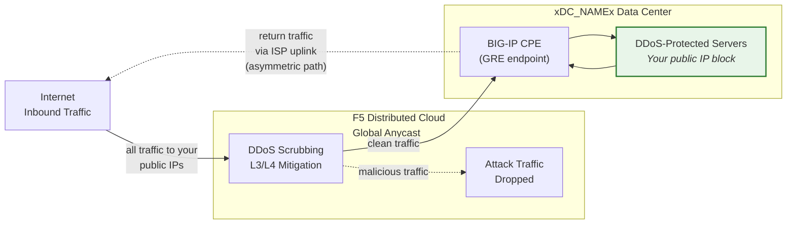
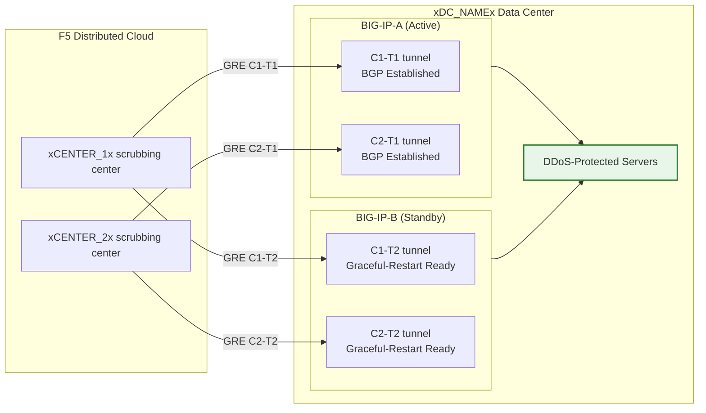

## 云端 GRE/BGP BIG-IP

- 从 BIG-IP HA 对（充当客户端设备，CPE）配置 **GRE 隧道**和 **BGP 对等互联**，
  每个单元拥有独立隧道。
- 以**路由模式**（L3/L4）连接至**云端 DDoS 缓解**清洗中心。

## 要求

- 为您的租户启用云端 **L3/L4 路由 DDoS 缓解**服务
  （始终开启或始终可用）。
- BIG-IP 需具备：
    - LTM（或等效网络模块）。
    - 已获得许可并启用**动态路由（BGP）**。
- 路由模式：至少一个**公开通告的 /24（或更短）**前缀用于保护
  （IPv6 最小为 **/48**）。
    - 受保护前缀**必须是公开可路由的**（非 RFC 1918）。
      当隧道穿越公共互联网时，GRE 外层端点也必须是公开可路由的；
      使用私有连接（L2、私有对等互联）的部署可使用 RFC 1918 端点地址。
- 您的数据中心/路由器与云端清洗中心之间的连通性。

## HA 架构

BIG-IP 部署为**主动/备用 HA 对**，每个单元拥有独立的 GRE 隧道和
BGP 会话，连接至每个清洗中心：

- **独立隧道端点**：每个 BIG-IP 单元拥有各自的非浮动外层自 IP
  （`traffic-group-local-only`）及其独立的 GRE 隧道集。BIG-IP-A 使用
  `xBIGIP_A_OUTER_V4x`，BIG-IP-B 使用 `xBIGIP_B_OUTER_V4x` 作为隧道端点。
  这样可避免隧道源依赖于浮动 IP。
- **独立 BGP 会话**：每个单元通过各自的隧道运行独立的 BGP 会话。
  BIG-IP-A 与 C1-T1 和 C2-T1 建立对等互联；BIG-IP-B 与 C1-T2 和 C2-T2
  建立对等互联。故障切换时，备用单元的 BGP 会话已处于建立状态，
  因此云端可立即切换流量。
- **配置同步**：隧道、自 IP 及路由配置通过 **config-sync** 在各单元之间同步。
  由于 `imish` BGP 配置是按单元划分的，每个单元维护各自的邻居声明。
  请验证同步是否涵盖所有 tmsh 对象。
- **主动/备用 BGP 行为**：主动单元以正常 BGP 属性通告受保护前缀。
  备用单元可以使用更长的 AS 路径预置（使其优先级较低）通告相同前缀，
  或在故障切换前抑制通告。请与 SOC 协调确定具体方式。
- **故障切换收敛**：启用 `graceful-restart` 并配置独立隧道后，
  新的主动单元已建立 BGP 会话。收敛取决于 BGP 最优路径选择切换至
  新主动单元的通告。请使用 `run sys failover standby` 进行测试。

:::note
上述独立隧道 HA 模型是客户侧设备冗余的推荐方案。在投入生产之前，
请与您的客户团队验证您的具体故障切换设计，特别是关于 AS 路径预置策略
和 BGP 重新收敛时间方面。
:::
