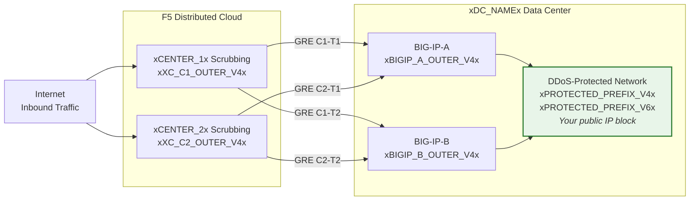
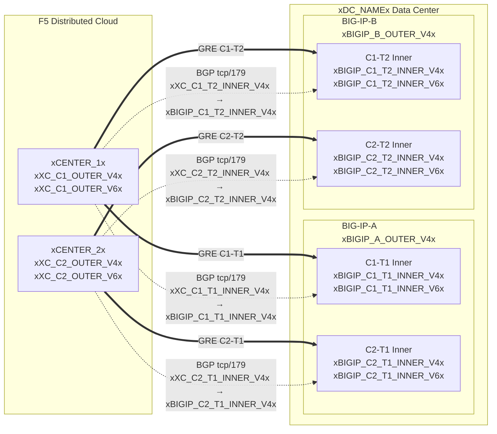

## 拓扑和地址

**xDC_NAMEx** 数据中心连接到云清洗中心的配置。

:::note
**以下为示例值。** 请使用上方表格中客户特定的值和 SOC 提供的值进行替换。

受保护前缀**必须是可公开路由的**（非 RFC 1918）。
当隧道经过公共互联网传输时，GRE 外部端点 IP 也必须是可公开路由的；私有连接（L2、私有对等）可以允许使用 RFC 1918 端点。参见
[K000147949](https://my.f5.com/manage/s/article/K000147949) 了解使用正确文档地址的示例。

为实现冗余，请为**每个 BIG-IP 设备创建 2 条隧道**，分别连接到不同地理位置的清洗中心（HA 对总共 4 条隧道）。
:::

## 工作表

在构建隧道配置时，请参考以下 XC 和 BIG-IP 工作表。

### XC

**隧道 C1-T1 — 中心 1 到 BIG-IP-A：**

- GRE 外部 IP（用于隧道端点）：
    - IPv4 SRC：`xXC_C1_OUTER_V4x/24`
    - IPv4 DST：`xBIGIP_A_OUTER_V4x/24`
    - IPv6 SRC：`xXC_C1_OUTER_V6x/64`
    - IPv6 DST：`xBIGIP_A_OUTER_V6x/64`

- GRE 内部 IP（用于 BGP 会话）：
    - IPv4：`xXC_C1_T1_INNER_V4x/30`
    - IPv6：`xXC_C1_T1_INNER_V6x/64`

**隧道 C1-T2 — 中心 1 到 BIG-IP-B：**

- GRE 外部 IP（用于隧道端点）：
    - IPv4 SRC：`xXC_C1_OUTER_V4x/24`
    - IPv4 DST：`xBIGIP_B_OUTER_V4x/24`
    - IPv6 SRC：`xXC_C1_OUTER_V6x/64`
    - IPv6 DST：`xBIGIP_B_OUTER_V6x/64`

- GRE 内部 IP（用于 BGP 会话）：
    - IPv4：`xXC_C1_T2_INNER_V4x/30`
    - IPv6：`xXC_C1_T2_INNER_V6x/64`

**隧道 C2-T1 — 中心 2 到 BIG-IP-A：**

- GRE 外部 IP（用于隧道端点）：
    - IPv4 SRC：`xXC_C2_OUTER_V4x/24`
    - IPv4 DST：`xBIGIP_A_OUTER_V4x/24`
    - IPv6 SRC：`xXC_C2_OUTER_V6x/64`
    - IPv6 DST：`xBIGIP_A_OUTER_V6x/64`

- GRE 内部 IP（用于 BGP 会话）：
    - IPv4：`xXC_C2_T1_INNER_V4x/30`
    - IPv6：`xXC_C2_T1_INNER_V6x/64`

**隧道 C2-T2 — 中心 2 到 BIG-IP-B：**

- GRE 外部 IP（用于隧道端点）：
    - IPv4 SRC：`xXC_C2_OUTER_V4x/24`
    - IPv4 DST：`xBIGIP_B_OUTER_V4x/24`
    - IPv6 SRC：`xXC_C2_OUTER_V6x/64`
    - IPv6 DST：`xBIGIP_B_OUTER_V6x/64`

- GRE 内部 IP（用于 BGP 会话）：
    - IPv4：`xXC_C2_T2_INNER_V4x/30`
    - IPv6：`xXC_C2_T2_INNER_V6x/64`

:::note[内部（中转）IP]
内部 IP 如 `10.10.10.0/30` 使用 RFC 1918 地址。这是正确的，因为它们封装在 GRE 隧道内部，不会出现在公共互联网上。受保护前缀必须始终是可公开路由的；当隧道经过公共互联网传输时，外部端点 IP 必须是可公开路由的。
:::

:::note[IPv6 内部链路]
此处 IPv6 内部链路使用 /64 前缀以匹配常见的云默认配置。对于点对点链路，根据 [RFC 6164](https://datatracker.ietf.org/doc/html/rfc6164) 建议使用 /127 以避免邻居发现耗尽。如果 SOC 隧道分配支持，请使用 /127。
:::

### BIG-IP

**BIG-IP-A**（外部 IP `xBIGIP_A_OUTER_V4x` / `xBIGIP_A_OUTER_V6x`）：

- GRE 外部 IP：
    - IPv4 SRC：`xBIGIP_A_OUTER_V4x/24`
    - IPv4 DST（中心 1）：`xXC_C1_OUTER_V4x/24`
    - IPv4 DST（中心 2）：`xXC_C2_OUTER_V4x/24`
    - IPv6 SRC：`xBIGIP_A_OUTER_V6x/64`
    - IPv6 DST（中心 1）：`xXC_C1_OUTER_V6x/64`
    - IPv6 DST（中心 2）：`xXC_C2_OUTER_V6x/64`

- GRE 内部 IP — 隧道 C1-T1：
    - IPv4：`xBIGIP_C1_T1_INNER_V4x/30`
    - IPv6：`xBIGIP_C1_T1_INNER_V6x/64`

- GRE 内部 IP — 隧道 C2-T1：
    - IPv4：`xBIGIP_C2_T1_INNER_V4x/30`
    - IPv6：`xBIGIP_C2_T1_INNER_V6x/64`

**BIG-IP-B**（外部 IP `xBIGIP_B_OUTER_V4x` / `xBIGIP_B_OUTER_V6x`）：

- GRE 外部 IP：
    - IPv4 SRC：`xBIGIP_B_OUTER_V4x/24`
    - IPv4 DST（中心 1）：`xXC_C1_OUTER_V4x/24`
    - IPv4 DST（中心 2）：`xXC_C2_OUTER_V4x/24`
    - IPv6 SRC：`xBIGIP_B_OUTER_V6x/64`
    - IPv6 DST（中心 1）：`xXC_C1_OUTER_V6x/64`
    - IPv6 DST（中心 2）：`xXC_C2_OUTER_V6x/64`

- GRE 内部 IP — 隧道 C1-T2：
    - IPv4：`xBIGIP_C1_T2_INNER_V4x/30`
    - IPv6：`xBIGIP_C1_T2_INNER_V6x/64`

- GRE 内部 IP — 隧道 C2-T2：
    - IPv4：`xBIGIP_C2_T2_INNER_V4x/30`
    - IPv6：`xBIGIP_C2_T2_INNER_V6x/64`

- 受保护前缀（通告到云端）：
    - IPv4：`xPROTECTED_NET_V4xxPROTECTED_CIDR_V4x`
    - IPv6：`xPROTECTED_PREFIX_V6x`

### 详细拓扑图

