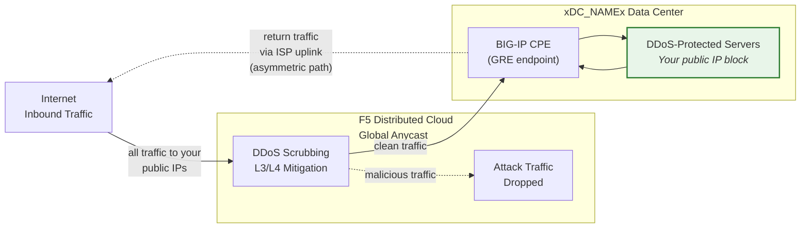
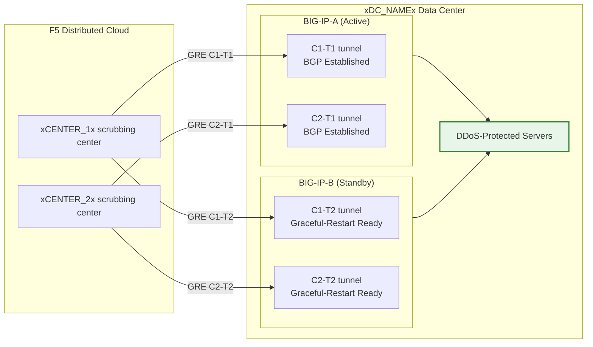

## Cloud GRE/BGP BIG-IP

- 從 BIG-IP HA 配對（作為客戶端設備，CPE）配置 **GRE 通道**和 **BGP 對等互連**，每個單元使用獨立的通道。
- 以**路由模式**（L3/L4）連接到 **Cloud DDoS 緩解**清洗中心。

## 需求

- 為您的租戶啟用 Cloud **L3/L4 路由式 DDoS 緩解**服務（Always On 或 Always Available）。
- BIG-IP 需具備：
    - LTM（或同等網路模組）。
    - **動態路由（BGP）**已授權並啟用。
- 路由模式：至少需要一個**公開通告的 /24（或更短）**前綴用於防護（IPv6 最小為 **/48**）。
    - 受保護的前綴**必須是可公開路由的**（非 RFC 1918）。當通道穿越公共網際網路時，GRE 外部端點也必須是可公開路由的；使用私有連接（L2、私有對等互連）的部署可以使用 RFC 1918 端點位址。
- 您的資料中心/路由器與 Cloud 清洗中心之間的連接。

## HA 架構

BIG-IP 部署為**主動/待命 HA 配對**，每個單元都擁有自己獨立的 GRE 通道和到每個清洗中心的 BGP 會話：

- **獨立通道端點**：每個 BIG-IP 單元都有自己的非浮動外部 self IP（`traffic-group-local-only`）和自己的 GRE 通道組。BIG-IP-A 使用 `xBIGIP_A_OUTER_V4x`，BIG-IP-B 使用 `xBIGIP_B_OUTER_V4x` 作為通道端點。這避免了通道來源依賴浮動 IP。
- **獨立 BGP 會話**：每個單元透過自己的通道運行自己的 BGP 會話。BIG-IP-A 與 C1-T1 和 C2-T1 對等互連；BIG-IP-B 與 C1-T2 和 C2-T2 對等互連。在故障轉移時，待命單元的 BGP 會話已經建立，因此 Cloud 可以立即轉移流量。
- **設定同步**：通道、self IP 和路由設定透過 **config-sync** 在單元之間同步。由於 `imish` BGP 設定是每個單元獨立的，每個單元維護自己的鄰居聲明。驗證同步是否包含所有 tmsh 物件。
- **主動/待命 BGP 行為**：主動單元以正常的 BGP 屬性通告受保護的前綴。待命單元可以使用較長的 AS-path prepend 通告相同的前綴（使其較不被優先選擇），或在故障轉移之前抑制通告。請與 SOC 協調方法。
- **故障轉移收斂**：啟用 `graceful-restart` 和獨立通道後，新的主動單元已經建立了 BGP 會話。收斂取決於 BGP 最佳路徑選擇轉移到新主動單元的通告。使用 `run sys failover standby` 進行測試。

:::note
上述獨立通道 HA 模型是客戶端設備冗餘的建議方法。在投入生產之前，請與您的帳戶團隊驗證您的特定故障轉移設計，特別是 AS-path prepend 策略和 BGP 重新收斂時間。
:::
