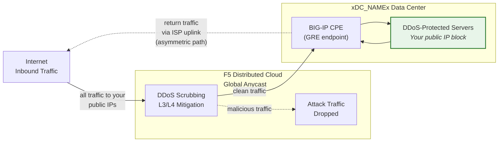
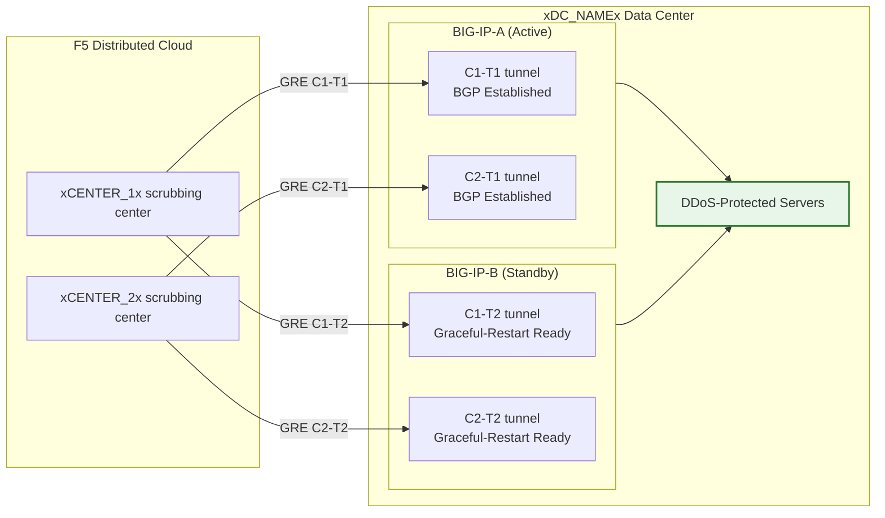

## 雲端 GRE/BGP BIG-IP

- 從 BIG-IP HA 配對（作為用戶端設備，CPE）設定 **GRE 隧道**與 **BGP 對等連線**，
  每個單元各自擁有獨立隧道。
- 以**路由模式**（L3/L4）連線至**雲端 DDoS 緩解**清洗中心。

## 需求

- 已為您的租戶啟用雲端 **L3/L4 路由 DDoS 緩解**服務
  （Always On 或 Always Available）。
- BIG-IP 需具備：
    - LTM（或同等網路模組）。
    - 已授權並啟用**動態路由（BGP）**。
- 路由模式：至少一個**公開通告的 /24（或更短）**前綴用於保護
  （IPv6 最小為 **/48**）。
    - 受保護前綴**必須為公開可路由**（非 RFC 1918）。
      當隧道穿越公共網際網路時，GRE 外層端點也必須為公開可路由；
      使用私有連線（L2、私有對等）的部署可使用 RFC 1918 端點位址。
- 您的資料中心/路由器與雲端清洗中心之間的連線能力。

## HA 架構

BIG-IP 以**主動/待機 HA 配對**方式部署，每個單元各自擁有獨立的
GRE 隧道與 BGP 工作階段，連接至每個清洗中心：

- **獨立隧道端點**：每個 BIG-IP 單元各自擁有非浮動的外層自我 IP
  （`traffic-group-local-only`）及其專屬的 GRE 隧道集合。BIG-IP-A 使用
  `xBIGIP_A_OUTER_V4x`，BIG-IP-B 使用 `xBIGIP_B_OUTER_V4x` 作為隧道端點。
  此設計避免了隧道來源依賴浮動 IP 的問題。
- **獨立 BGP 工作階段**：每個單元透過其專屬隧道執行自己的 BGP 工作階段。
  BIG-IP-A 與 C1-T1 及 C2-T1 建立對等連線；BIG-IP-B 與 C1-T2 及 C2-T2
  建立對等連線。在容錯移轉時，待機單元的 BGP 工作階段已處於已建立狀態，
  因此雲端可立即切換流量。
- **設定同步**：隧道、自我 IP 及路由設定透過 **config-sync** 在單元間同步。
  由於 `imish` BGP 設定為每個單元各自獨立，每個單元維護其自己的鄰居陳述式。
  請確認同步範圍涵蓋所有 tmsh 物件。
- **主動/待機 BGP 行為**：主動單元以正常 BGP 屬性通告受保護前綴。
  待機單元可選擇以較長的 AS-path prepend（使其較不優先）通告相同前綴，
  或在容錯移轉前抑制通告。請與 SOC 協調確認採用的方式。
- **容錯移轉收斂**：在啟用 `graceful-restart` 並使用獨立隧道的情況下，
  新的主動單元已具備已建立的 BGP 工作階段。收斂時間取決於 BGP 最佳路徑
  選擇切換至新主動單元的通告。請使用 `run sys failover standby` 進行測試。

:::note
上述獨立隧道 HA 模型為用戶端設備冗餘的建議方案。
在投入生產前，請與您的客戶團隊確認您的具體容錯移轉設計，
特別是關於 AS-path prepend 策略與 BGP 重新收斂時間的部分。
:::
