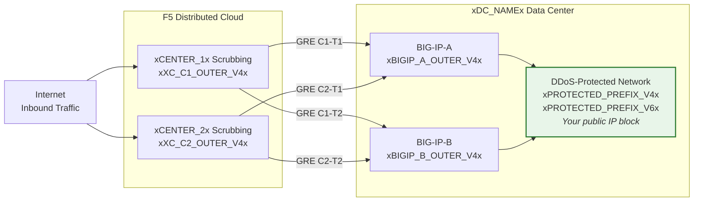
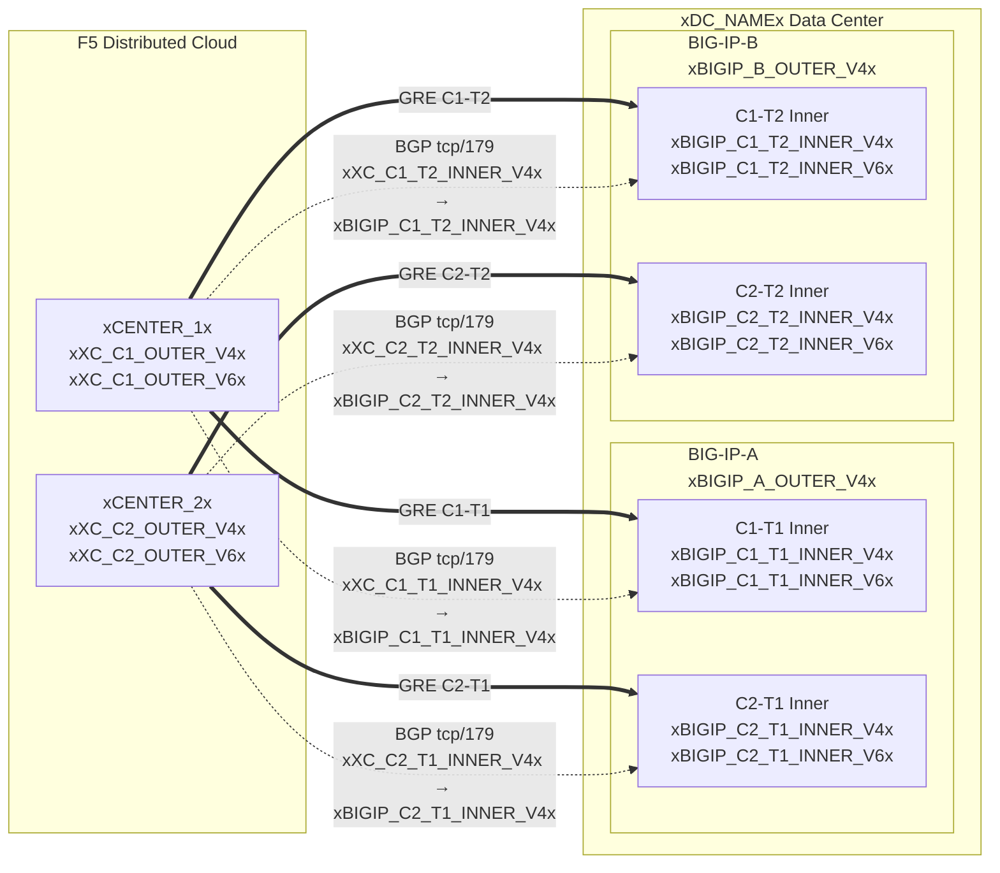

## 拓撲與位址

**xDC_NAMEx** 資料中心連接至雲端清洗中心的設定。

:::note
**以下為範例值。** 請使用上方表格中客戶專屬及 SOC 提供的值進行替換。

受保護的前綴**必須可公開路由**（非 RFC 1918）。
當隧道穿越公共網際網路時，GRE 外部端點 IP 也必須可公開路由；私有連線（L2、私有對等互連）可允許使用 RFC 1918 端點。請參閱
[K000147949](https://my.f5.com/manage/s/article/K000147949) 以取得使用正確文件位址的範例。

為確保備援，請為每台 BIG-IP 裝置建立 **2 條隧道**，連接至不同地理位置的清洗中心（HA 配對共 4 條隧道）。
:::

## 工作表

在建立隧道設定時，請參考以下 XC 與 BIG-IP 工作表。

### XC

**隧道 C1-T1 — 中心 1 至 BIG-IP-A：**

- GRE 外部 IP（用於隧道端點）：
    - IPv4 SRC：`xXC_C1_OUTER_V4x/24`
    - IPv4 DST：`xBIGIP_A_OUTER_V4x/24`
    - IPv6 SRC：`xXC_C1_OUTER_V6x/64`
    - IPv6 DST：`xBIGIP_A_OUTER_V6x/64`

- GRE 內部 IP（用於 BGP 工作階段）：
    - IPv4：`xXC_C1_T1_INNER_V4x/30`
    - IPv6：`xXC_C1_T1_INNER_V6x/64`

**隧道 C1-T2 — 中心 1 至 BIG-IP-B：**

- GRE 外部 IP（用於隧道端點）：
    - IPv4 SRC：`xXC_C1_OUTER_V4x/24`
    - IPv4 DST：`xBIGIP_B_OUTER_V4x/24`
    - IPv6 SRC：`xXC_C1_OUTER_V6x/64`
    - IPv6 DST：`xBIGIP_B_OUTER_V6x/64`

- GRE 內部 IP（用於 BGP 工作階段）：
    - IPv4：`xXC_C1_T2_INNER_V4x/30`
    - IPv6：`xXC_C1_T2_INNER_V6x/64`

**隧道 C2-T1 — 中心 2 至 BIG-IP-A：**

- GRE 外部 IP（用於隧道端點）：
    - IPv4 SRC：`xXC_C2_OUTER_V4x/24`
    - IPv4 DST：`xBIGIP_A_OUTER_V4x/24`
    - IPv6 SRC：`xXC_C2_OUTER_V6x/64`
    - IPv6 DST：`xBIGIP_A_OUTER_V6x/64`

- GRE 內部 IP（用於 BGP 工作階段）：
    - IPv4：`xXC_C2_T1_INNER_V4x/30`
    - IPv6：`xXC_C2_T1_INNER_V6x/64`

**隧道 C2-T2 — 中心 2 至 BIG-IP-B：**

- GRE 外部 IP（用於隧道端點）：
    - IPv4 SRC：`xXC_C2_OUTER_V4x/24`
    - IPv4 DST：`xBIGIP_B_OUTER_V4x/24`
    - IPv6 SRC：`xXC_C2_OUTER_V6x/64`
    - IPv6 DST：`xBIGIP_B_OUTER_V6x/64`

- GRE 內部 IP（用於 BGP 工作階段）：
    - IPv4：`xXC_C2_T2_INNER_V4x/30`
    - IPv6：`xXC_C2_T2_INNER_V6x/64`

:::note[內部（傳輸）IP]
內部 IP（例如 `10.10.10.0/30`）使用 RFC 1918 位址。這是正確的，因為這些位址被封裝在 GRE 隧道內部，永遠不會出現在公共網際網路上。受保護的前綴必須始終可公開路由；當隧道穿越公共網際網路時，外部端點 IP 也必須可公開路由。
:::

:::note[IPv6 內部鏈路]
此處 IPv6 內部鏈路使用 /64 前綴，以符合常見的雲端預設值。對於點對點鏈路，依據 [RFC 6164](https://datatracker.ietf.org/doc/html/rfc6164) 建議使用 /127，以避免鄰居探索耗盡問題。若 SOC 隧道分配支援，請使用 /127。
:::

### BIG-IP

**BIG-IP-A**（外部 IP `xBIGIP_A_OUTER_V4x` / `xBIGIP_A_OUTER_V6x`）：

- GRE 外部 IP：
    - IPv4 SRC：`xBIGIP_A_OUTER_V4x/24`
    - IPv4 DST（中心 1）：`xXC_C1_OUTER_V4x/24`
    - IPv4 DST（中心 2）：`xXC_C2_OUTER_V4x/24`
    - IPv6 SRC：`xBIGIP_A_OUTER_V6x/64`
    - IPv6 DST（中心 1）：`xXC_C1_OUTER_V6x/64`
    - IPv6 DST（中心 2）：`xXC_C2_OUTER_V6x/64`

- GRE 內部 IP — 隧道 C1-T1：
    - IPv4：`xBIGIP_C1_T1_INNER_V4x/30`
    - IPv6：`xBIGIP_C1_T1_INNER_V6x/64`

- GRE 內部 IP — 隧道 C2-T1：
    - IPv4：`xBIGIP_C2_T1_INNER_V4x/30`
    - IPv6：`xBIGIP_C2_T1_INNER_V6x/64`

**BIG-IP-B**（外部 IP `xBIGIP_B_OUTER_V4x` / `xBIGIP_B_OUTER_V6x`）：

- GRE 外部 IP：
    - IPv4 SRC：`xBIGIP_B_OUTER_V4x/24`
    - IPv4 DST（中心 1）：`xXC_C1_OUTER_V4x/24`
    - IPv4 DST（中心 2）：`xXC_C2_OUTER_V4x/24`
    - IPv6 SRC：`xBIGIP_B_OUTER_V6x/64`
    - IPv6 DST（中心 1）：`xXC_C1_OUTER_V6x/64`
    - IPv6 DST（中心 2）：`xXC_C2_OUTER_V6x/64`

- GRE 內部 IP — 隧道 C1-T2：
    - IPv4：`xBIGIP_C1_T2_INNER_V4x/30`
    - IPv6：`xBIGIP_C1_T2_INNER_V6x/64`

- GRE 內部 IP — 隧道 C2-T2：
    - IPv4：`xBIGIP_C2_T2_INNER_V4x/30`
    - IPv6：`xBIGIP_C2_T2_INNER_V6x/64`

- 受保護的前綴（向雲端公告）：
    - IPv4：`xPROTECTED_NET_V4xxPROTECTED_CIDR_V4x`
    - IPv6：`xPROTECTED_PREFIX_V6x`

### 詳細拓撲圖

